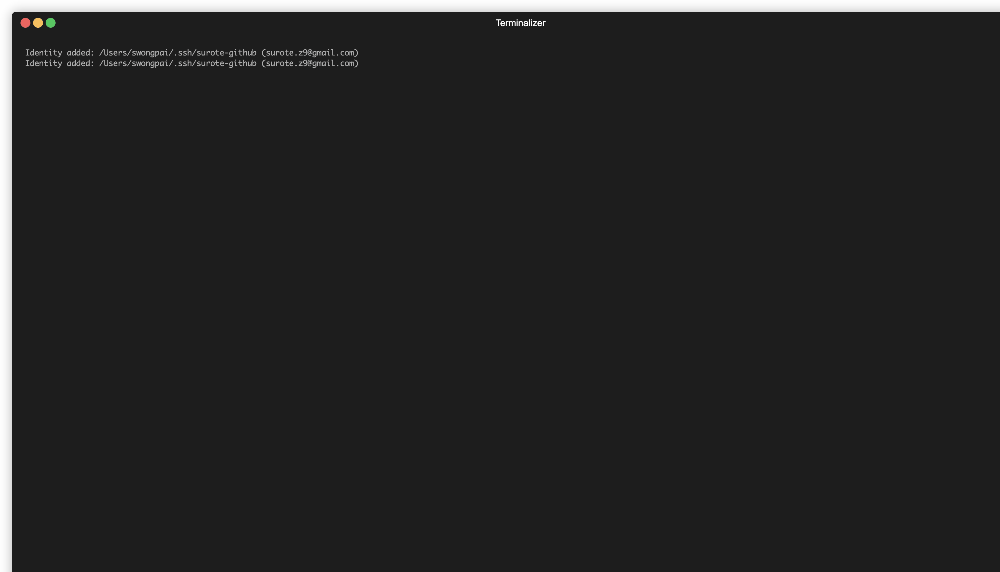

# Cluster Health



A quick checklist of `oc` commands to assess an OpenShift cluster's overall health.

---

### Cluster Operators

Check whether every cluster operator is available, not degraded, and not progressing.

```bash
oc get co
```

Look for operators where `AVAILABLE` is `False`, `PROGRESSING` is `True`, or `DEGRADED` is `True`. Drill into a specific operator for details:

```bash
oc describe co <operator-name>
```

---

### Nodes

Verify that all nodes are in `Ready` status.

```bash
oc get nodes
```

Show resource usage across nodes:

```bash
oc adm top nodes
```

Get detailed info for a specific node:

```bash
oc describe node <node-name>
```

---

### Cluster Version

Check the current cluster version and upgrade status.

```bash
oc get clusterversion
```

For detailed upgrade history and conditions:

```bash
oc describe clusterversion
```

---

### Pods

Find pods that are not running or healthy across all namespaces:

```bash
oc get pods -A --field-selector=status.phase!=Running,status.phase!=Succeeded
# easy to remember
oc get pod -A | grep -v 'Running\|Completed'
```

Check for pods with high restart counts (possible crash loops):

```bash
oc get pods -A | awk '$5 > 0'
```

---

### Events

Review recent cluster-wide events for warnings or errors:

```bash
oc get events -A --sort-by='.lastTimestamp' --field-selector type=Warning
```

---

### Machine Config Pool

Check if all machine config pools have finished rolling out:

```bash
oc get mcp
```

Pools are healthy when `UPDATED` is `True`, `UPDATING` is `False`, and `DEGRADED` is `False`.

---

### Certificate Signing Requests

Look for pending CSRs that might block new nodes from joining:

```bash
oc get csr
```

Approve pending CSRs if appropriate:

```bash
oc adm certificate approve <csr-name>
```

---

