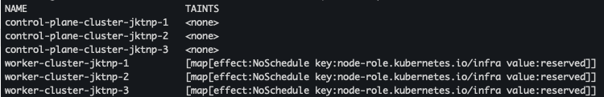

# Placement

```
oc adm taint node -l node-role.kubernetes.io/infra node-role.kubernetes.io/infra=reserved:NoSchedule
```

```
# Check tainted
oc get nodes -o custom-columns='NAME:.metadata.name,TAINTS:.spec.taints'
```



```
# untainted
oc adm taint node -l node-role.kubernetes.io/infra node-role.kubernetes.io/infra-
```


<TODO> This module must include node label, taint and how deployment tolerate it and how to select node to place ment<TODO>