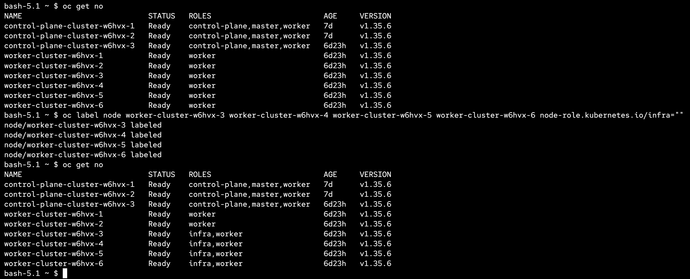
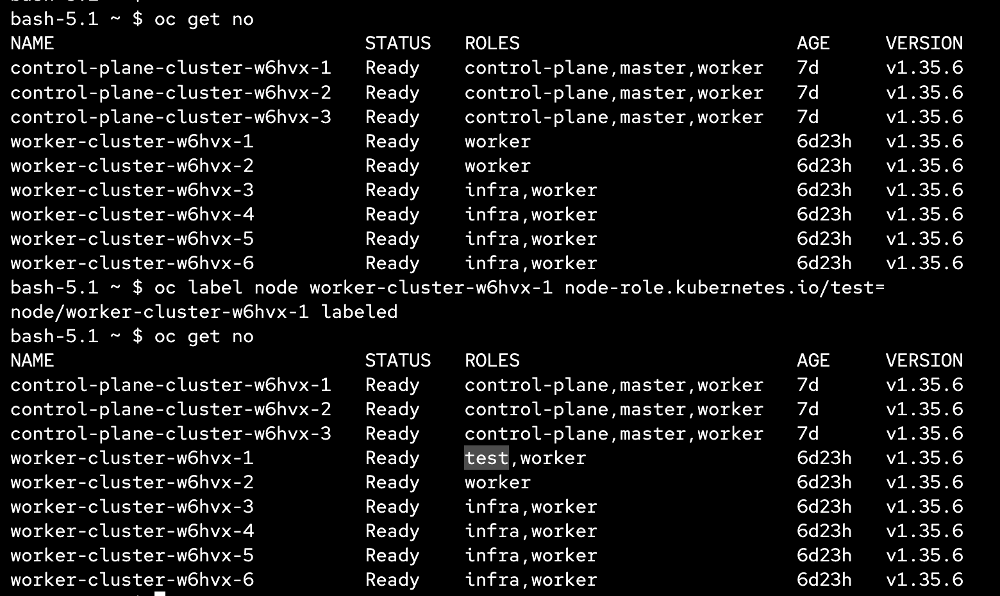
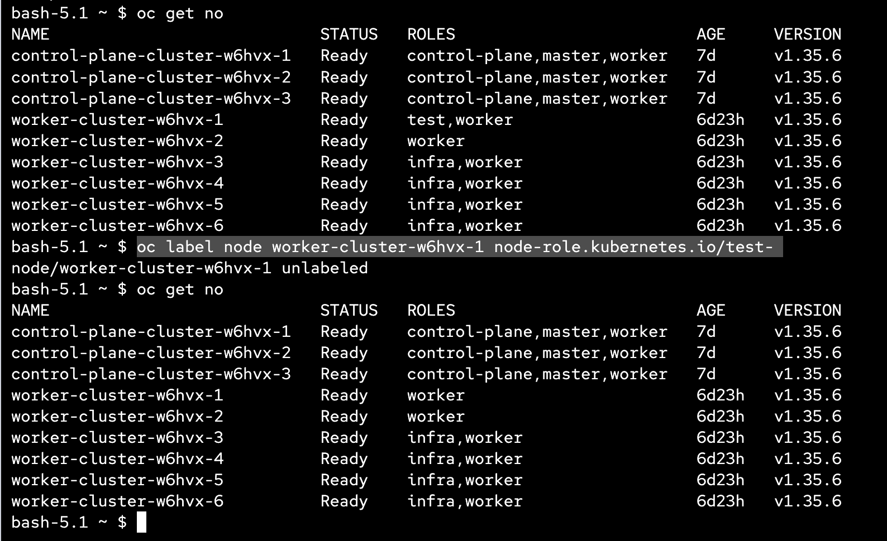
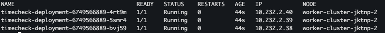

# Placement

This module covers node labeling, tainting, and pod placement — how to control which workloads run on which nodes using labels, taints/tolerations, and node selectors.

---

### Node Labels

Labels are key-value pairs attached to nodes. They are used by `nodeSelector` and node affinity rules to schedule pods onto specific nodes.

Add a label to a node:

```bash
oc label node <node-name> node-role.kubernetes.io/infra=""
```



Add a label to multiple nodes by selector:

```bash
oc label node -l <existing-label> <new-label-key>=<new-label-value>
```

Check node labels:

```bash
oc get nodes --show-labels
```

EXAMPLE output
```bash
NAME                            STATUS   ROLES                         AGE     VERSION   LABELS
control-plane-cluster-w6hvx-1   Ready    control-plane,master,worker   7d      v1.35.6   beta.kubernetes.io/arch=amd64,beta.kubernetes.io/os=linux,kubernetes.io/arch=amd64,kubernetes.io/hostname=control-plane-cluster-w6hvx-1,kubernetes.io/os=linux,node-role.kubernetes.io/control-plane=,node-role.kubernetes.io/master=,node-role.kubernetes.io/worker=,node.openshift.io/os_id=rhel
control-plane-cluster-w6hvx-2   Ready    control-plane,master,worker   7d      v1.35.6   beta.kubernetes.io/arch=amd64,beta.kubernetes.io/os=linux,kubernetes.io/arch=amd64,kubernetes.io/hostname=control-plane-cluster-w6hvx-2,kubernetes.io/os=linux,node-role.kubernetes.io/control-plane=,node-role.kubernetes.io/master=,node-role.kubernetes.io/worker=,node.openshift.io/os_id=rhel
control-plane-cluster-w6hvx-3   Ready    control-plane,master,worker   7d      v1.35.6   beta.kubernetes.io/arch=amd64,beta.kubernetes.io/os=linux,kubernetes.io/arch=amd64,kubernetes.io/hostname=control-plane-cluster-w6hvx-3,kubernetes.io/os=linux,node-role.kubernetes.io/control-plane=,node-role.kubernetes.io/master=,node-role.kubernetes.io/worker=,node.openshift.io/os_id=rhel
worker-cluster-w6hvx-1          Ready    worker                        6d23h   v1.35.6   beta.kubernetes.io/arch=amd64,beta.kubernetes.io/os=linux,kubernetes.io/arch=amd64,kubernetes.io/hostname=worker-cluster-w6hvx-1,kubernetes.io/os=linux,node-role.kubernetes.io/worker=,node.openshift.io/os_id=rhel
worker-cluster-w6hvx-2          Ready    worker                        6d23h   v1.35.6   beta.kubernetes.io/arch=amd64,beta.kubernetes.io/os=linux,kubernetes.io/arch=amd64,kubernetes.io/hostname=worker-cluster-w6hvx-2,kubernetes.io/os=linux,node-role.kubernetes.io/worker=,node.openshift.io/os_id=rhel
worker-cluster-w6hvx-3          Ready    infra,worker                  6d23h   v1.35.6   beta.kubernetes.io/arch=amd64,beta.kubernetes.io/os=linux,kubernetes.io/arch=amd64,kubernetes.io/hostname=worker-cluster-w6hvx-3,kubernetes.io/os=linux,node-role.kubernetes.io/infra=,node-role.kubernetes.io/worker=,node.openshift.io/os_id=rhel
worker-cluster-w6hvx-4          Ready    infra,worker                  6d23h   v1.35.6   beta.kubernetes.io/arch=amd64,beta.kubernetes.io/os=linux,kubernetes.io/arch=amd64,kubernetes.io/hostname=worker-cluster-w6hvx-4,kubernetes.io/os=linux,node-role.kubernetes.io/infra=,node-role.kubernetes.io/worker=,node.openshift.io/os_id=rhel
worker-cluster-w6hvx-5          Ready    infra,worker                  6d23h   v1.35.6   beta.kubernetes.io/arch=amd64,beta.kubernetes.io/os=linux,kubernetes.io/arch=amd64,kubernetes.io/hostname=worker-cluster-w6hvx-5,kubernetes.io/os=linux,node-role.kubernetes.io/infra=,node-role.kubernetes.io/worker=,node.openshift.io/os_id=rhel
worker-cluster-w6hvx-6          Ready    infra,worker                  6d23h   v1.35.6   beta.kubernetes.io/arch=amd64,beta.kubernetes.io/os=linux,kubernetes.io/arch=amd64,kubernetes.io/hostname=worker-cluster-w6hvx-6,kubernetes.io/os=linux,node-role.kubernetes.io/infra=,node-role.kubernetes.io/worker=,node.openshift.io/os_id=rhel
```

Add wrong label
```bash
oc label node <node-name> 
```


Remove a label (trailing `-`):

```bash
oc label node <node-name> <label-key>-
```


---

### Taints

Taints prevent pods from being scheduled on a node unless the pod has a matching toleration. This is commonly used to reserve infra nodes for platform components only.

Taint all infra nodes:

```bash
oc adm taint node -l node-role.kubernetes.io/infra node-role.kubernetes.io/infra=reserved:NoSchedule
```

Check taints:

```bash
oc get nodes -o custom-columns='NAME:.metadata.name,TAINTS:.spec.taints'
```


Remove the taint (trailing `-`):

```bash
oc adm taint node -l node-role.kubernetes.io/infra node-role.kubernetes.io/infra-
```

Taint effects:

| Effect | Behavior |
|---|---|
| `NoSchedule` | New pods without a matching toleration are not scheduled on the node |
| `PreferNoSchedule` | Scheduler tries to avoid the node but will place pods there if no other option exists |
| `NoExecute` | Existing pods without a matching toleration are evicted, and new pods are not scheduled |

---

### Tolerations

For a pod to be scheduled on a tainted node, it must declare a matching toleration. Example for the infra taint above:

```yaml
spec:
  tolerations:
    - key: node-role.kubernetes.io/infra
      operator: Equal
      value: reserved
      effect: NoSchedule
```

Toleration operators:

| Operator | Behavior | `value` field |
|---|---|---|
| `Equal` | Matches only when the taint `key`, `value`, and `effect` all match exactly | Required |
| `Exists` | Matches any taint with the given `key` and `effect`, regardless of value | Must be omitted |

`Exists` is useful when you don't care about the taint value, or when you want to tolerate all taints on a key:

```yaml
tolerations:
  - key: node-role.kubernetes.io/infra
    operator: Exists
    effect: NoSchedule
```

Omitting `effect` with `Exists` tolerates all effects for that key. Omitting both `key` and `effect` tolerates everything (matches all taints).

---

### Node Selector

A `nodeSelector` ensures a pod only runs on nodes with the specified labels:

```yaml
spec:
  nodeSelector:
    node-role.kubernetes.io/infra: ""
```

---

### Putting It Together

A typical pattern for placing workloads on infra nodes uses both `nodeSelector` and `tolerations` together:

```yaml
spec:
  nodeSelector:
    node-role.kubernetes.io/infra: ""
  tolerations:
    - key: node-role.kubernetes.io/infra
      operator: Equal
      value: reserved
      effect: NoSchedule
```

This ensures the pod:
1. Is **only scheduled on infra nodes** (via `nodeSelector`)
2. Is **allowed on tainted infra nodes** (via `tolerations`)

---

### Deploy Sample Application

Apply the sample application that demonstrates placement on infra nodes:

```bash
oc apply -f manifests/00-application.yaml
```

This deploys a `timecheck-deployment` (3 replicas) with `nodeSelector` targeting `infra-logmon` nodes and a toleration for the infra taint:

```yaml
spec:
  nodeSelector:
    node-role.kubernetes.io/infra-logmon: ""
  tolerations:
    - key: node-role.kubernetes.io/infra
      operator: Equal
      value: reserved
      effect: NoSchedule
```

Verify that all pods are placed on the expected infra nodes:

```bash
oc get pods -n 02-module -o wide
```


