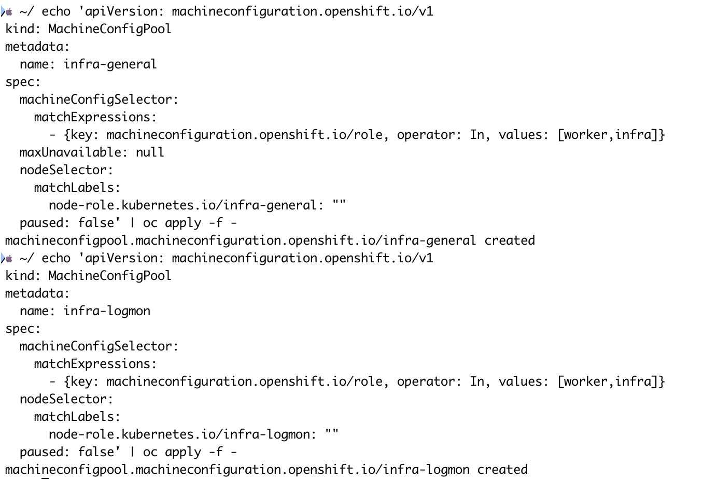
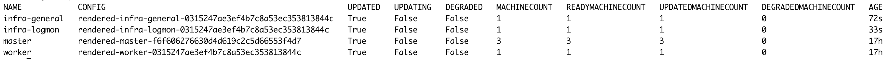

# Node MachineConfig

This module demonstrates how to work with MachineConfigPool (MCP) to manage node roles and apply machine-level configuration in OpenShift.

---

## Overview

A **MachineConfigPool** groups nodes by label so that MachineConfig resources (NTP, file writes, kernel arguments, etc.) can target specific sets of nodes. In this example we create two custom pools for infra workloads:

- `infra-general` — general-purpose infra nodes (e.g. ingress, registry)
- `infra-observe` — infra nodes dedicated to logging and monitoring

---

## Existing MachineConfigPools

By default, OpenShift ships with two MachineConfigPools: `master` and `worker`.

```bash
oc get mcp
```


Notice the `worker` pool shows **MACHINECOUNT 2** instead of 4. This is because in the previous module we removed the `node-role.kubernetes.io/worker` label from the infra nodes. Since the `worker` MCP selects nodes by that label, those infra nodes are no longer counted in the `worker` pool.

---

## Step 1 — Apply the MachineConfigPool Manifests

```bash
oc apply -f manifests/mcp-infra-general.yaml
oc apply -f manifests/mcp-infra-observe.yaml
```



---

## Step 2 — Verify

Check that the new pools are created and all machines are updated:

```bash
oc get mcp
```

Pools are healthy when `UPDATED` is `True`, `UPDATING` is `False`, and `DEGRADED` is `False`.



---

## Manifests Reference

| File | MCP Name | Node Selector Label |
|---|---|---|
| `mcp-infra-general.yaml` | `infra-general` | `node-role.kubernetes.io/infra-general` |
| `mcp-infra-logmon.yaml` | `infra-logmon` | `node-role.kubernetes.io/infra-logmon` |

Both pools use `machineConfigSelector` matching roles `[worker, infra]`, meaning they inherit all MachineConfigs targeted at `worker` or `infra` roles.