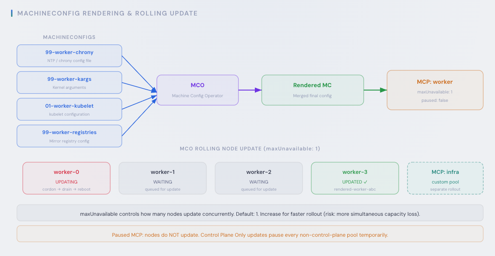
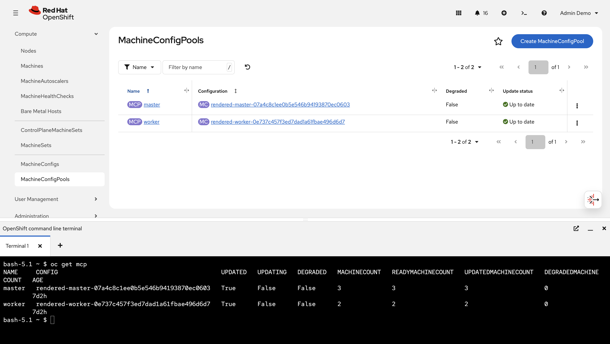
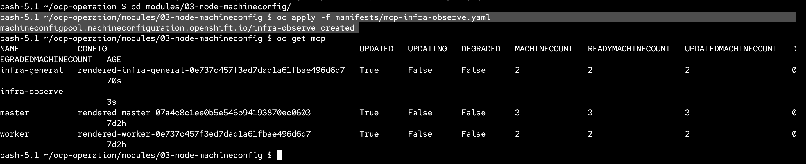
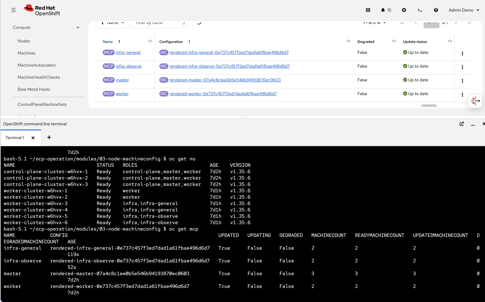
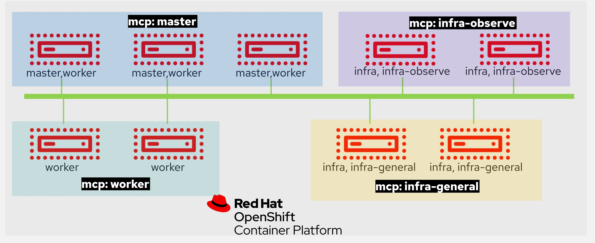

# Node MachineConfig

This module demonstrates how to work with MachineConfigPool (MCP) to manage node roles and apply machine-level configuration in OpenShift.

---

## Overview



MCP (MachineConfigPool) ใช้สำหรับแบ่งกลุ่มเครื่องในคลัสเตอร์ เพื่อกำหนดค่า configuration ระดับ OS เช่น NTP, multipath, kernel arguments หรือการเขียนไฟล์ต่าง ๆ ลงบนเครื่อง ทำให้สามารถกำหนดค่าให้แต่ละกลุ่มแตกต่างกันได้ตามลักษณะงาน เช่น กลุ่ม worker ตั้ง max pods = 300 ขณะที่กลุ่ม infra-general ตั้ง max pods = 250

อย่างไรก็ตาม MCP ทำหน้าที่กำหนดว่า "เครื่องจะถูกตั้งค่าอย่างไร" เท่านั้น ไม่ได้กำหนดว่า workload ใดจะไปรันบนเครื่องไหน ซึ่งส่วนนั้นควบคุมด้วย label, taint/toleration และ nodeSelector ของ workload แทน

A **MachineConfigPool** groups nodes by label so that MachineConfig resources (NTP, file writes, kernel arguments, etc.) can target specific sets of nodes. In this example we create two custom pools for infra workloads:

- `infra-general` — general-purpose infra nodes (e.g. ingress, registry)
- `infra-observe` — infra nodes dedicated to logging and monitoring

---

## Existing MachineConfigPools

By default, OpenShift ships with two MachineConfigPools: `master` and `worker`.

```bash
oc get mcp
```



Notice the `worker` pool shows **MACHINECOUNT 2** instead of 6. This is because in the previous module we removed the `node-role.kubernetes.io/worker` label from the infra nodes. Since the `worker` MCP selects nodes by that label, those infra nodes are no longer counted in the `worker` pool.

---

## Step 1 — Apply and Verify the MachineConfigPool Manifests

Each MCP manifest defines two key selectors:

- **`nodeSelector`** — determines which nodes belong to this pool. For example, `infra-general` selects nodes with the label `node-role.kubernetes.io/infra-general`.
- **`machineConfigSelector`** — determines which MachineConfig resources are applied to nodes in this pool. Both pools use a `matchExpressions` with `In [worker, <pool-role>]`, so they inherit all MachineConfigs targeted at the `worker` role in addition to their own.

```bash
oc apply -f manifests/mcp-infra-general.yaml
oc apply -f manifests/mcp-infra-observe.yaml
```



After applying, the infra nodes are picked up by their respective pools based on the labels we assigned in module 02. You can verify with `oc get no` to see the roles and `oc get mcp` to confirm each pool has the correct machine count.



---

## Manifests Reference

| File | MCP Name | Node Selector Label |
|---|---|---|
| `mcp-infra-general.yaml` | `infra-general` | `node-role.kubernetes.io/infra-general` |
| `mcp-infra-observe.yaml` | `infra-observe` | `node-role.kubernetes.io/infra-observe` |

Both pools use `machineConfigSelector` matching roles `[worker, <pool-role>]`, meaning they inherit all MachineConfigs targeted at the `worker` role while also accepting pool-specific MachineConfigs (e.g. `infra-general` or `infra-observe`).

