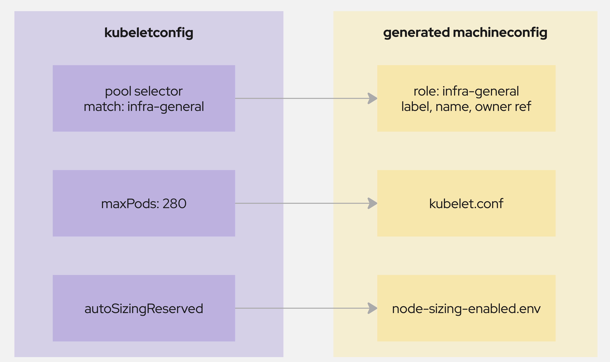
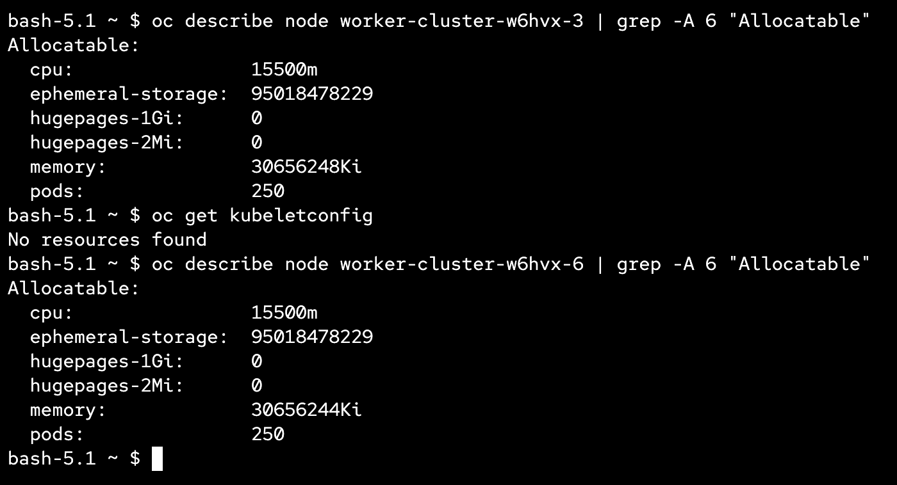
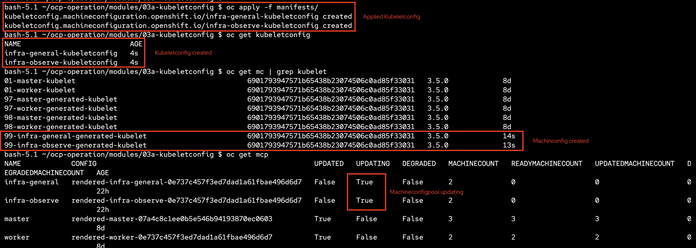
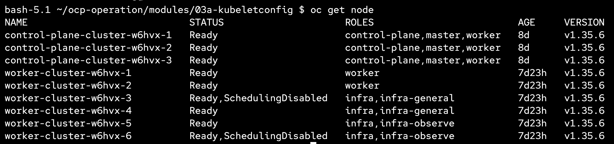
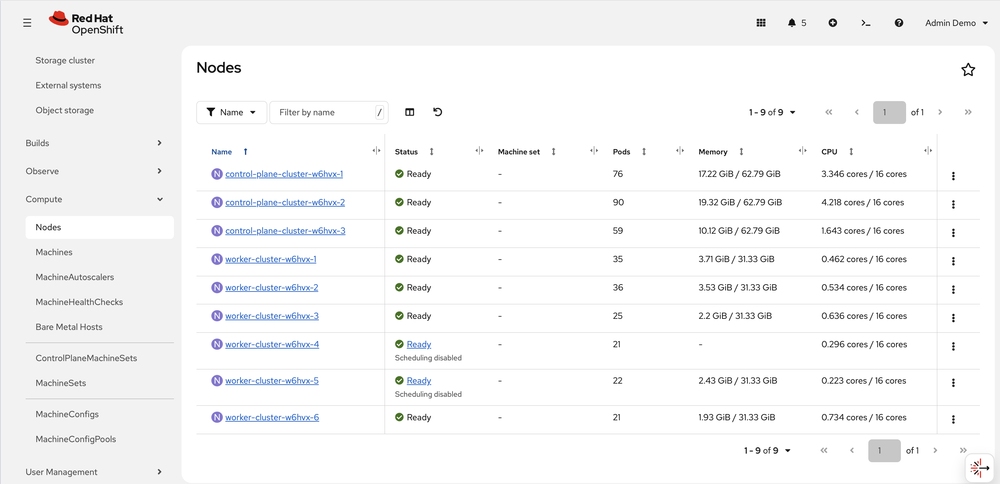
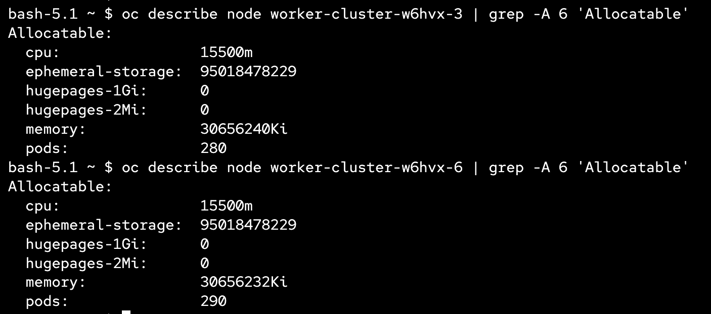

# KubeletConfig

This module demonstrates how to customise kubelet settings per MachineConfigPool using the **KubeletConfig** custom resource in OpenShift.

---

## Overview



KubeletConfig เป็น kind ที่ใช้ปรับแต่งค่าของ kubelet บน node เช่น `maxPods`
ต่อ node, `systemReserved` หรือค่าอื่น ๆ ที่เป็นของ kubelet โดยตรง

การทำงานเริ่มจาก `machineConfigPoolSelector` ใน KubeletConfig ที่ระบุ label
ของ MachineConfigPool ที่ต้องการ จากนั้น Machine Config Operator จะสร้าง
MachineConfig ชื่อ `99-<pool>-generated-kubelet` ขึ้นมาให้อัตโนมัติ โดย
MachineConfig ตัวนี้จะมี ownerReference ชี้กลับมาที่ KubeletConfig เดิม
ถ้าลบ KubeletConfig ทิ้ง MachineConfig ที่ถูกสร้างก็จะหายไปด้วย

MachineConfig ที่ได้จะถูกนำไป merge รวมกับ MachineConfig ตัวอื่น ๆ ของ pool
เดียวกันตามลำดับชื่อ กลายเป็น `rendered-<pool>-<hash>` แล้ว Machine Config
Daemon บนแต่ละ node จะ cordon, drain, เขียนไฟล์ `/etc/kubernetes/kubelet.conf`
และ reboot เครื่อง เพื่อให้ kubelet อ่านค่าใหม่

ผลลัพธ์คือทุกเครื่องใน MachineConfigPool ที่ KubeletConfig เลือกไว้จะได้ค่า
เดียวกันทั้งหมด

A **KubeletConfig** resource lets you override default kubelet parameters (e.g. `maxPods`, system-reserved resources) for a specific set of nodes selected through a MachineConfigPool label. In this module we apply two KubeletConfig objects — one for each infra pool created in module 03:

- `infra-general-kubeletconfig` — targets `infra-general` nodes, sets `maxPods: 280`
- `infra-observe-kubeletconfig` — targets `infra-observe` nodes, sets `maxPods: 290`

Both configs enable `autoSizingReserved: true`, which lets the kubelet automatically calculate system-reserved CPU and memory based on the node's capacity.

> **Note:** The default `maxPods` is **250**. The hard upper limit depends on the host prefix — a `/23` CIDR allows up to **510** pods per node. The values here are intentionally above the default for testing purposes.

---

## Prerequisites

- Module 03 (Node MachineConfig) must be completed — the `infra-general` and `infra-observe` MachineConfigPools must already exist.

---

## Check existing configuration

ตรวจสอบค่าของ cpu,memory,pods ที่สามารถใช้งานได้ ของ `infra-general` และ `infra-observe`

```bash
oc describe node <node-name> | grep -A 6 'Allocatable'
```




โดยที่เครื่อง `..-3` คือ `infra-general` และเครื่อง `..-6` คือ `infra-observe` ที่ถูกกำหนดมาจาก 02-placement ทั้งคู่มี pods: 250 ซึ่งเป็นค่าตั้งต้น

## Step 1 — Apply the KubeletConfig Manifests

```bash
oc apply -f manifests/infra-general.yaml
oc apply -f manifests/infra-observe.yaml
```

---

## Step 2 — Verify the Rollout

Applying a KubeletConfig triggers a rolling update of the targeted MachineConfigPool. Monitor progress with:



`oc get node`


`Compute > Nodes`


```bash
oc get mcp -w
```

Wait until both `infra-general` and `infra-observe` pools show `UPDATED: True`, `UPDATING: False`, and `DEGRADED: False`.

ตรวจสอบค่าของ cpu,memory,pods ที่สามารถใช้งานได้ ของ `infra-general` และ `infra-observe` หลังจาก machineconfigpool อัพเดทสำเร็จและ node กลับมา Ready ทั้งหมดแล้ว

```bash
oc describe node <node-name> | grep -A 6 'Allocatable'
```


pods มีการเปลี่ยนแปลงตามที่ถูกกำหนดไว้ใน kubeletconfig

>**เพิ่มเติม** จำนวน cpu,memory ไม่ได้ปรับเนื่องจาก cluster ถูกติดตั้งที่ version 4.22 autosizingreserve จะติดตั้งให้เป็นค่าตั้งต้นดังนั้นการที่ทำ kubeletconfig เพื่อ autosizingreserve จึงไม่ได้มีผล แต่สำหรับ cluster ที่ติดตั้งมาก่อน 4.22 หรือ 4.21 ยังจำเป็นต้องทำตามขั้นตอนนี้ https://docs.redhat.com/en/documentation/openshift_container_platform/4.21/html/nodes/working-with-nodes#nodes-nodes-resources-configuring สูตรการคำนวนสามารถดูต่อได้ที่ https://github.com/openshift/machine-config-operator/blob/main/templates/common/_base/files/kubelet-auto-sizing.yaml 
---

## Manifests Reference

| File | KubeletConfig Name | Target MCP Label | maxPods | autoSizingReserved |
|---|---|---|---|---|
| `infra-general.yaml` | `infra-general-kubeletconfig` | `infra-general` | 280 | true |
| `infra-observe.yaml` | `infra-observe-kubeletconfig` | `infra-observe` | 290 | true |
