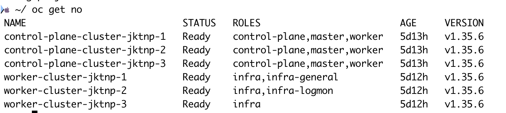
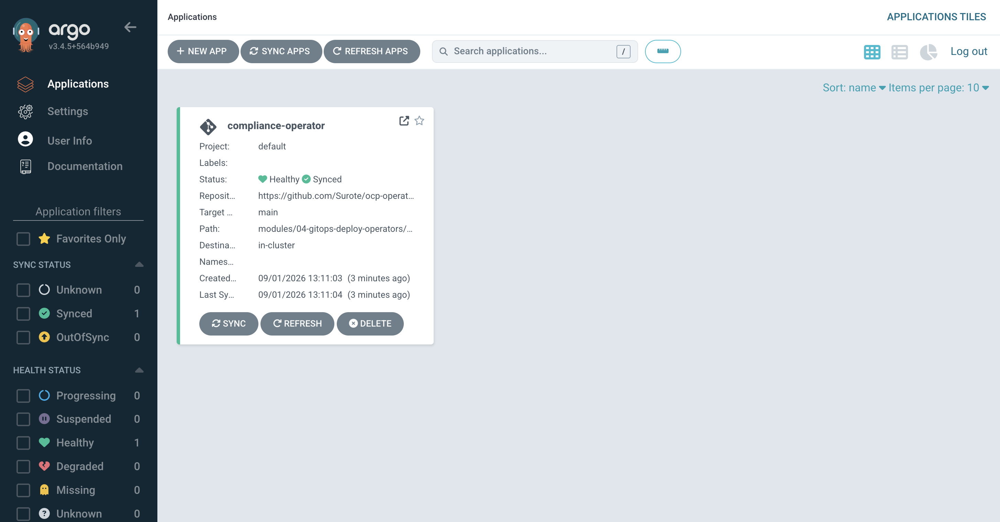
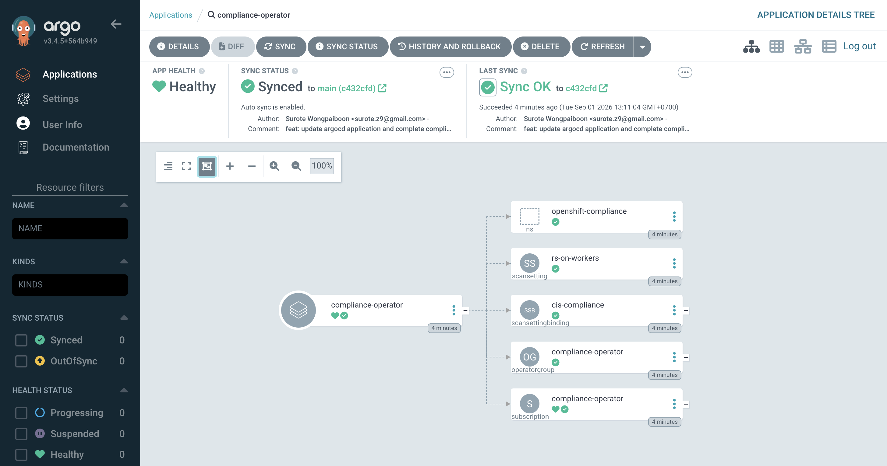
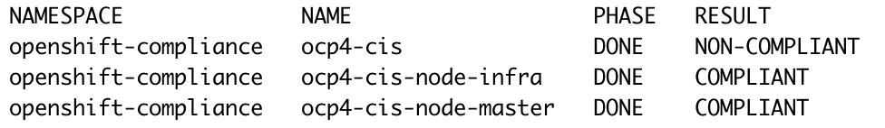

# GitOps Deploy Operators

This module demonstrates deploying the **Compliance Operator** via OpenShift GitOps (Argo CD), including the operator subscription, scan settings, and scan setting bindings.

---

### Prerequisites

Cluster nodes should be ready with the expected roles (control-plane, infra):



---

### Manifests

The `manifests/` directory contains the resources that Argo CD will sync:

| File | Kind | Description |
|---|---|---|
| `namespace.yaml` | `Namespace` | Creates the `openshift-compliance` namespace |
| `operatorgroup.yaml` | `OperatorGroup` | Scopes the operator to the target namespace |
| `subscription.yaml` | `Subscription` | Installs the Compliance Operator from `redhat-operators` (stable channel, manual approval) |
| `scansetting.yaml` | `ScanSetting` | Defines scan schedule (`0 17 * * *`), target roles (`master`, `infra`), and raw result storage on worker nodes |
| `scansettingbinding.yaml` | `ScanSettingBinding` | Binds `ocp4-cis-node` and `ocp4-cis` profiles to the `rs-on-workers` scan setting |

> **Note:** The subscription uses `installPlanApproval: Manual`. After Argo CD syncs the subscription, you must manually approve the InstallPlan before the operator is installed:
>
> ```bash
> oc get installplan -n openshift-compliance
> oc patch installplan <installplan-name> -n openshift-compliance --type merge -p '{"spec":{"approved":true}}'
> ```

---

### Deploy with Argo CD

Apply the Argo CD Application:

```bash
oc apply -f application.yaml
```

This creates an Application named `compliance-operator` in the `openshift-gitops` namespace that syncs the manifests directory with auto-prune and self-heal enabled.

Once synced, the Argo CD dashboard shows the application as Healthy and Synced:



The application detail tree shows all managed resources — namespace, subscription, operator group, scan setting, and scan setting binding:



---

### Verify Compliance Scan Results

After the operator is installed and the scan runs, check the results:

```bash
oc get compliancesuite -n openshift-compliance
```


