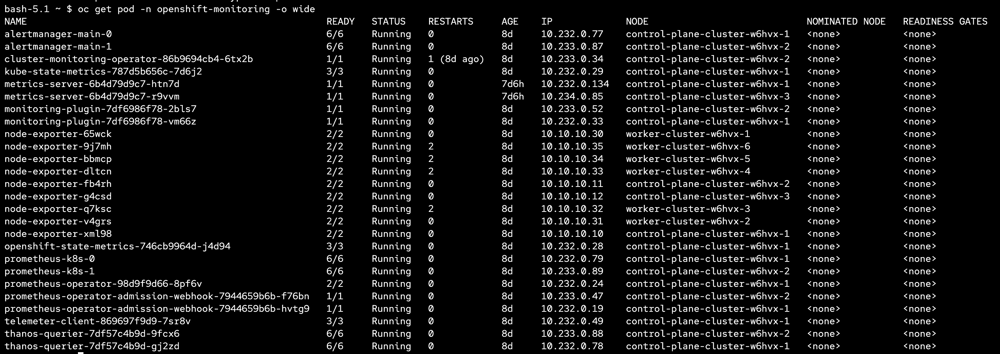
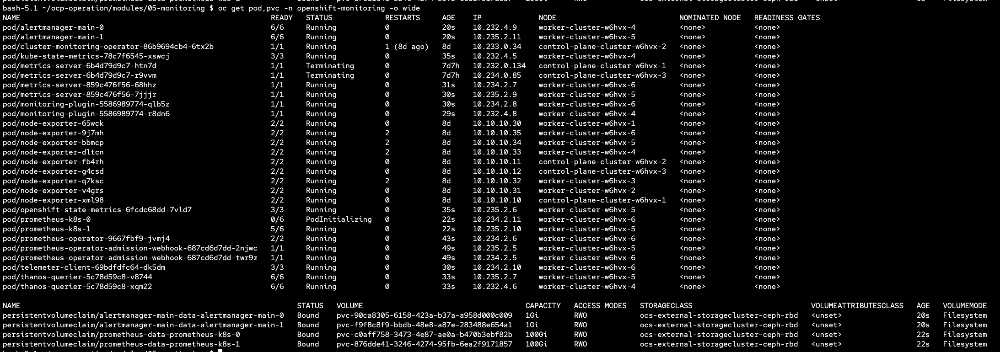
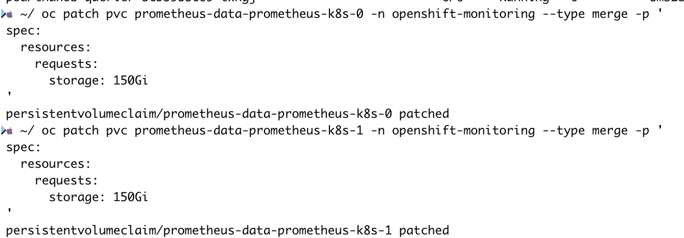
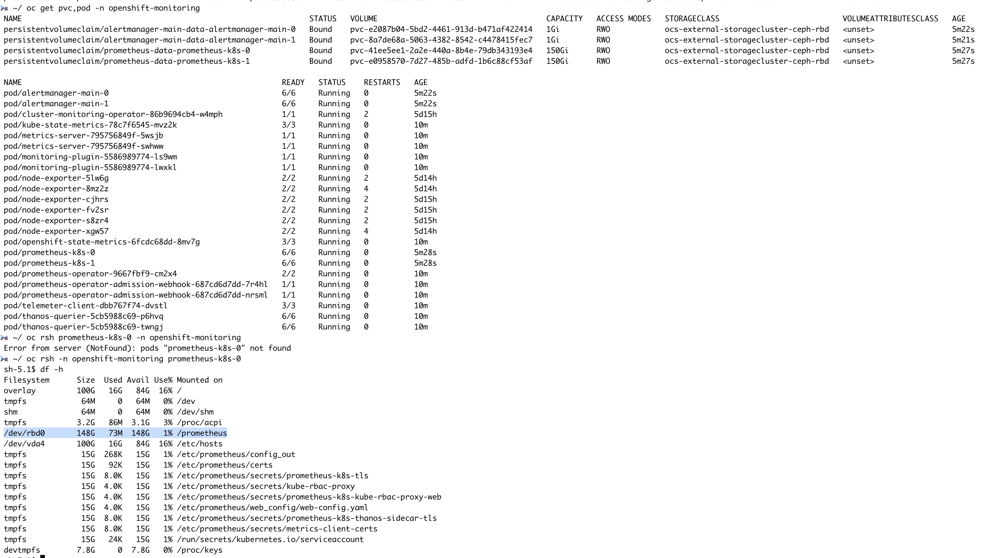
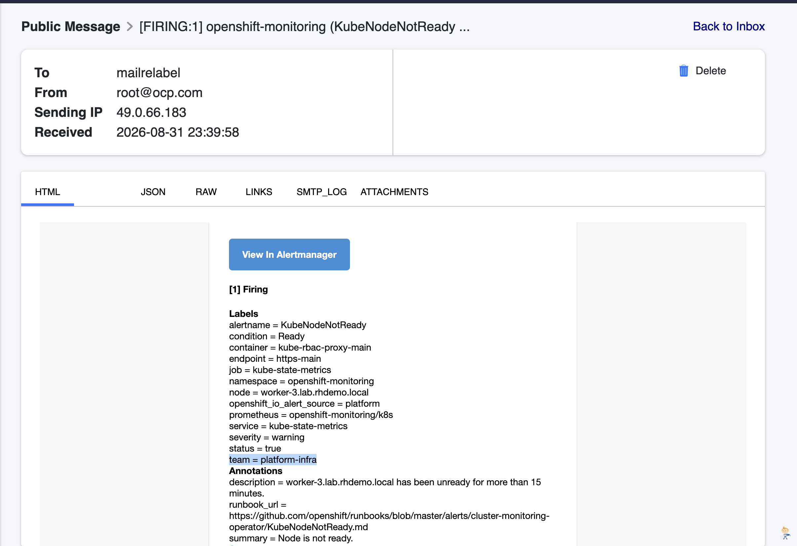

# Monitoring

This module covers the OpenShift monitoring stack configuration — moving components to infra nodes, setting retention/storage, and using AlertRelabelConfig to enrich alerts.

---

### Monitoring Stack Configuration

Apply the cluster monitoring ConfigMap to configure all monitoring components:

```bash
oc apply -f manifests/cm-openshift-monitoring.yaml
```

This ConfigMap (`cluster-monitoring-config` in `openshift-monitoring`) configures the following:

| Component | Node Selector | Storage | Other |
|---|---|---|---|
| `alertmanagerMain` | `infra` | `5Gi` (`standard-csi`) | — |
| `prometheusK8s` | `infra` | `100Gi` (`standard-csi`) | `retention: 15d` |
| `prometheusOperator` | `infra` | — | — |
| `monitoringPlugin` | `infra` | — | — |
| `metricsServer` | `infra` | — | — |
| `kubeStateMetrics` | `infra` | — | — |
| `telemeterClient` | `infra` | — | — |
| `openshiftStateMetrics` | `infra` | — | — |
| `thanosQuerier` | `infra` | — | — |

All components are pinned to infra nodes with a matching toleration for `node-role.kubernetes.io/infra`.

---

## Check existing monitoring workloads

```bash
oc get pod -n openshift-monitoring -o wide
```


pods ต่างๆของ monitoring จะรันอยู่ที่ worker nodes ทั้งหมด ยกเว้น `daemonset` เนื่องจาก `infra` node เราได้ทำการ `tainted` ไว้ 


## Move Monitoring components to infra nodes

ทำการย้าย pods ต่างๆของ monitoring ไปไว้ที่ `infra` node เพื่อประหยัดพื้นที่ของ worker เพื่อใช้งานได้เต็มที่สำหรับ application workload

```bash
oc apply -f manifests/cm-openshift-monitoring.yaml
```

pods ต่างๆจะเริ่มย้ายไปรันที่ `infra` node



---
### Changing Prometheus Retention

Edit the `prometheusK8s.retention` field in the ConfigMap:

```bash
oc edit configmap cluster-monitoring-config -n openshift-monitoring
```

```yaml
prometheusK8s:
  retention: 10d
```

---

### Expanding Prometheus PVC

If the storage class supports volume expansion (CSI), resize by patching the PVC directly:

```bash
oc patch pvc prometheus-data-prometheus-k8s-0 -n openshift-monitoring --type merge -p '
spec:
  resources:
    requests:
      storage: 200Gi
'
```

Verify:

```bash
oc get pvc,pod -n openshift-monitoring
```


After applying the monitoring ConfigMap, all monitoring pods and PVCs should be running on infra nodes with the configured storage:



---

### Alert Relabeling

`AlertRelabelConfig` lets you add, modify, or drop labels on platform alerts before they reach Alertmanager. This is useful for routing alerts to specific teams or receivers.

Apply the relabel config:

```bash
oc apply -f manifests/platform-alert-relabel-01.yaml
```

This example adds a `team: platform-infra` label to the `KubeNodeNotReady` alert:

```yaml
apiVersion: monitoring.openshift.io/v1
kind: AlertRelabelConfig
metadata:
  name: kube-node-notready-team
  namespace: openshift-monitoring
spec:
  configs:
    - sourceLabels: [alertname]
      regex: "KubeNodeNotReady"
      targetLabel: team
      replacement: platform-infra
      action: Replace
```

| Parameter | Description |
|---|---|
| `sourceLabels` | List of label names to match against |
| `regex` | Regex pattern to match on the concatenated source label values |
| `targetLabel` | The label to set on the alert |
| `replacement` | The value to set on the target label |
| `action` | `Replace`, `Keep`, `Drop`, `HashMod`, `LabelMap`, `LabelDrop`, `LabelKeep` |

Once applied, the `KubeNodeNotReady` alert will carry the `team = platform-infra` label, which can be used in Alertmanager to route notifications to the correct receiver.

> **Note:** `AlertRelabelConfig` only modifies labels on the Alertmanager side. The relabeled labels will appear in Alertmanager and in notifications (e.g. email, webhook), but they will **not** be visible in the OpenShift web console Observe > Alerting UI, which reads alerts directly from Prometheus before relabeling is applied.

