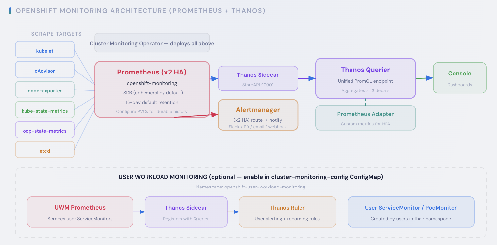
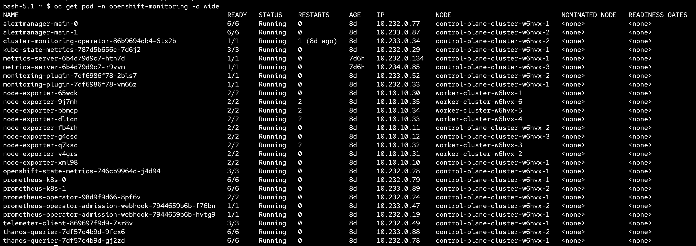
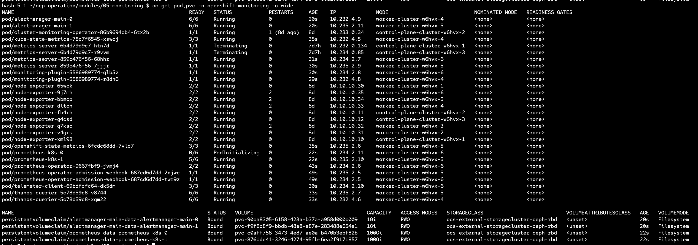
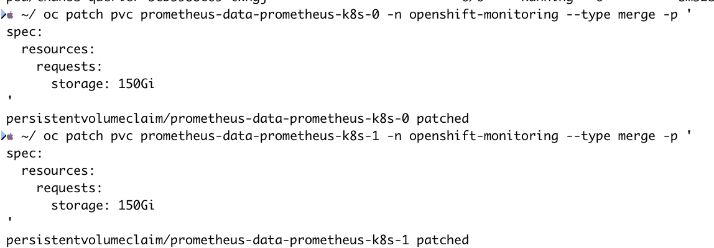
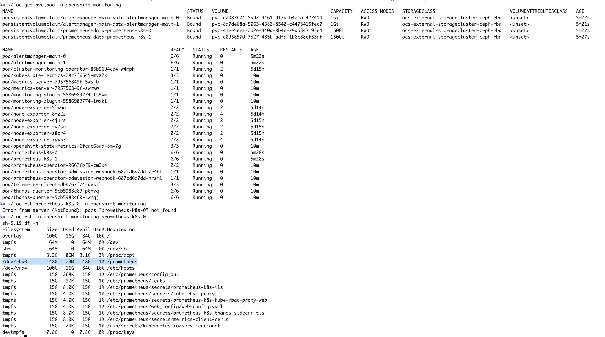
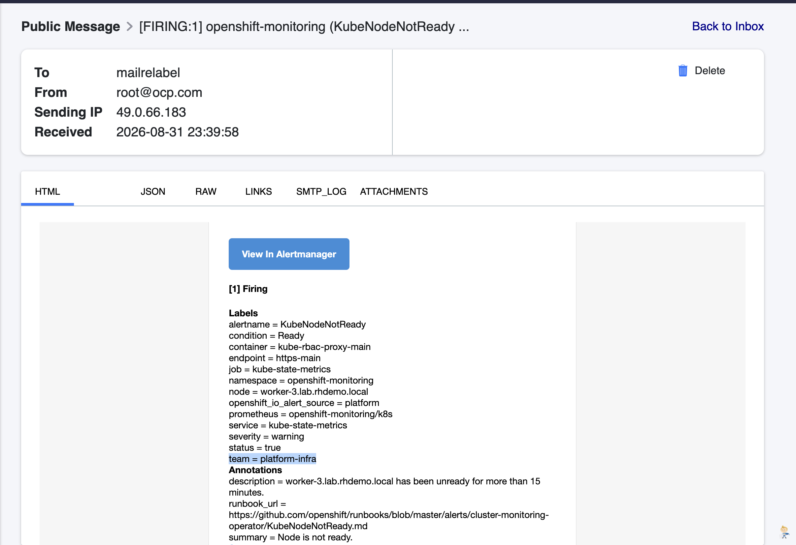
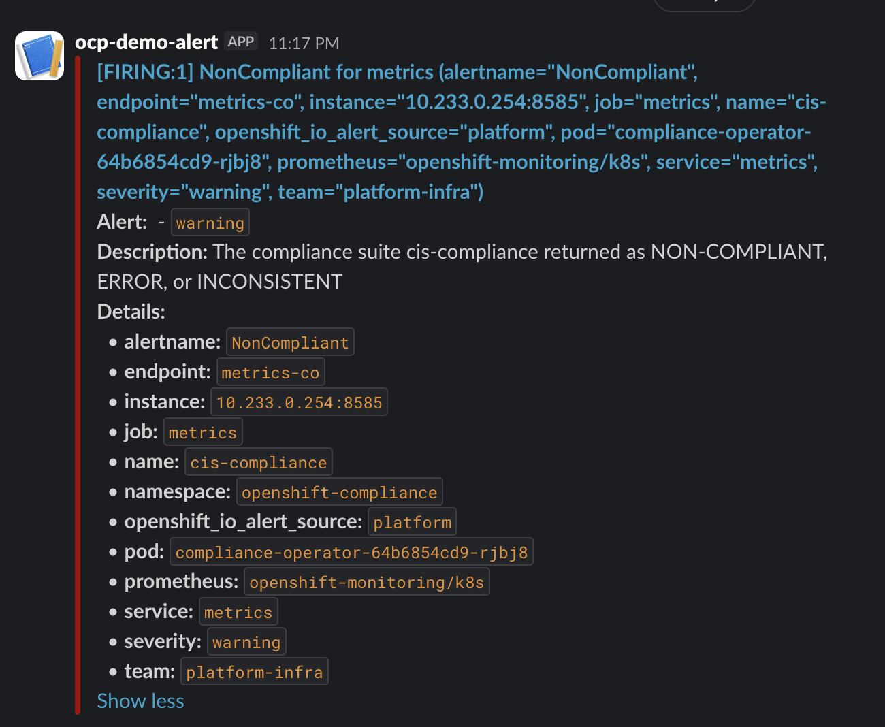
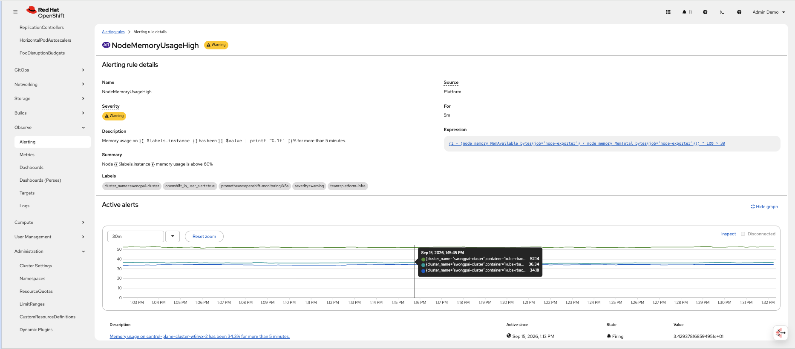
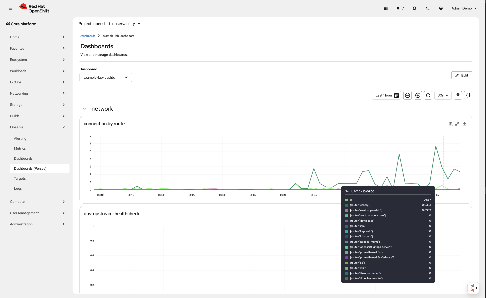
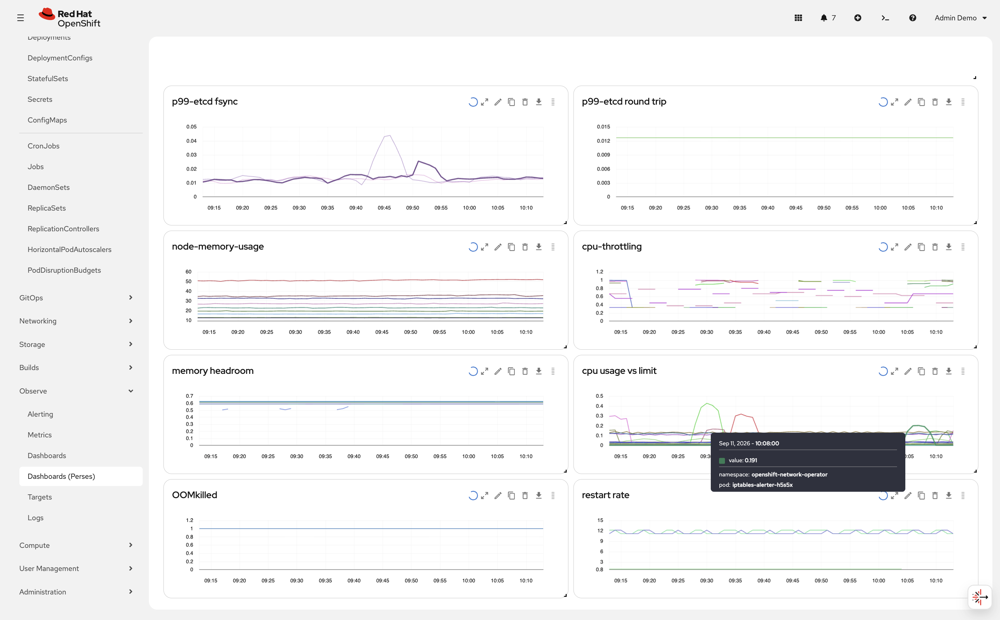

# Monitoring

การตั้งค่า OpenShift Monitoring เช่น ย้าย pod ต่างๆใน project openshift-monitoring ไปยังเครื่อง infra, การปรับค่าระยะเวลาในการเก็บข้อมูล / ขนาดของ storage, การสร้าง label สำหรับ alert 

---



### Monitoring Stack Configuration


```bash
oc apply -f manifests/cm-openshift-monitoring.yaml
```

Configmap จะถูก monitoring operator ดึงไปเพื่อทำการอัพเดท monitoring stack ให้เป็นไปตามที่กำหนด (`cluster-monitoring-config` ใน project `openshift-monitoring`):

| Component | Node Selector | Storage | Other |
|---|---|---|---|
| `alertmanagerMain` | `infra-observe` | `1Gi` (`ocs-external-storagecluster-ceph-rbd`) | — |
| `prometheusK8s` | `infra-observe` | `100Gi` (`ocs-external-storagecluster-ceph-rbd`) | `retention: 2d` |
| `prometheusOperator` | `infra-observe` | — | — |
| `monitoringPlugin` | `infra-observe` | — | — |
| `metricsServer` | `infra-observe` | — | — |
| `kubeStateMetrics` | `infra-observe` | — | — |
| `telemeterClient` | `infra-observe` | — | — |
| `openshiftStateMetrics` | `infra-observe` | — | — |
| `thanosQuerier` | `infra-observe` | — | — |

ทุก pod จะถูกกำหนดให้ tolerate กับค่า taint ที่กำหนดไว้บนเครื่อง infra  `node-role.kubernetes.io/infra`.

---

## Check existing monitoring workloads

```bash
oc get pod -n openshift-monitoring -o wide
```


pods ต่างๆของ monitoring จะรันอยู่ที่ worker nodes ทั้งหมด ยกเว้น `daemonset` เนื่องจาก `infra` node เราได้ทำการ `tainted` ไว้ 


## Move Monitoring components to infra nodes

ทำการย้าย pods ต่างๆของ monitoring ไปไว้ที่ `infra` node เพื่อประหยัดพื้นที่ของ worker เพื่อใช้งานได้เต็มที่สำหรับ application workload

```bash
oc apply -f manifests/cm-openshift-monitoring.yaml
```

pods ต่างๆจะเริ่มย้ายไปรันที่ `infra` node และมี PVC เพื่อใช้ในการเก็บข้อมูล metrics ของ prometheus และ alertmanager ที่ใช้ในการเก็บข้อมูลสำหรับการแจ้งเตือน
สังเกตุว่า pods ต่างๆจะไปรันอยู่ที่ `infra` node ที่ 5-6 เนื่องจาก config มีการเลือก node label ให้ใช้ `infra-observe`



---
### Changing Prometheus Retention

Edit the `prometheusK8s.retention` field in the ConfigMap:

```bash
oc edit configmap cluster-monitoring-config -n openshift-monitoring
```

```yaml
prometheusK8s:
  retention: 10d
```

---

### Expanding Prometheus PVC

ถ้า Storage Class รองรับการเพิ่มขนาดของ pvc เราสามารถใช้ command เพื่อปรับขนาดของ pvc สำหรับพื้นที่ของ Prometheus ได้

```bash
oc patch pvc prometheus-data-prometheus-k8s-0 -n openshift-monitoring --type merge -p '
spec:
  resources:
    requests:
      storage: 200Gi
'
```

ตรวจสอบ:

```bash
oc get pvc,pod -n openshift-monitoring
```


หลังจาก apply configmap pod ต่างๆของ monitoring จะต้องอยู่ที่ node ที่เราตั้งค่าไว้และขนาดของ storage ที่ขอ:



---

### Alert Relabeling

`AlertRelabelConfig` ให้เราสามารถ เพิ่ม ลด label ของ alert ที่ติดมากับ OpenShift ได้ เพื่อสะดวกในการเลือกส่ง alert ให้กับทีมต่างๆ

Apply the relabel config:

```bash
oc apply -f manifests/platform-alert-relabel-01.yaml
oc apply -f manifests/platform-alert-relabel-non-compliance.yaml
```

ตัวอย่าคือเพิ่ม label `team: platform-infra` ให้กับ alert ชื่อ `KubeNodeNotReady`:

```yaml
apiVersion: monitoring.openshift.io/v1
kind: AlertRelabelConfig
metadata:
  name: kube-node-notready-team
  namespace: openshift-monitoring
spec:
  configs:
    - sourceLabels: [alertname]
      regex: "KubeNodeNotReady"
      targetLabel: team
      replacement: platform-infra
      action: Replace
```

| Parameter | Description |
|---|---|
| `sourceLabels` | List of label names to match against |
| `regex` | Regex pattern to match on the concatenated source label values |
| `targetLabel` | The label to set on the alert |
| `replacement` | The value to set on the target label |
| `action` | `Replace`, `Keep`, `Drop`, `HashMod`, `LabelMap`, `LabelDrop`, `LabelKeep` |

หลังจาก config `KubeNodeNotReady` alert จะมี label `team = platform-infra` ซึ่งเราสามารถใช้ใน Alertmanager เพื่อทำการส่งต่อไปให้ยังผู้รับที่ต้องการผ่านการตั้งค่า route, receiver ได้.

> **Note:** `AlertRelabelConfig` only modifies labels on the Alertmanager side. The relabeled labels will appear in Alertmanager and in notifications (e.g. email, webhook), but they will **not** be visible in the OpenShift web console Observe > Alerting UI, which reads alerts directly from Prometheus before relabeling is applied.



หรือส่งผ่าน slack


---

## Custom Alert

เราสามารถสร้าง custom alert ตาม promql ที่เราสนใจได้เองโดยใช้ kind alertingrule ถ้่าเป็น platform alert และต้องอยู่ใน namespace openshift-monitoring สำหรับ user-workload-monitoring สามารถทำได้ใน namespace ของ application แต่จะใช้ kind prometheusrule

ตัวอย่าง custom alert ที่จะส่ง alert เมื่อเครื่องมีการใช้งาน memory เกินค่าที่กำหนด
```bash
oc apply -f manifests/platform-alert-node-usage-high-mem.yaml
```



---

## Custom dashboard with Perse 

Cluster Observe Operator 1.5+ GA ทำให้เราสามารถปรับแต่ง dashboard และ panel เองได้ ตาม promQL ที่เราต้องการจาก metric ที่เรามีใน cluster ได้

- ทำหลังจาก 06-logging

สร้าง UIplugin เพื่อเปิดใช้งาน custom dashboard
```bash 
oc apply -f manifests/perses-monitoring-custom-dashboard.yaml
```
>**re-authentication required**

ตัวอย่าง dashboard ที่สร้างแล้ว สามารถ import เข้าไปได้คล้ายๆ grafana json


```bash 
oc apply -f manifests/perses-example-dashboard.yaml
```

>เลือก project: openshift-observability แล้วไปที่ Observe>Dashboards (Perses) เลือก Dashboard ที่ชื่อ example lab-dashboard




