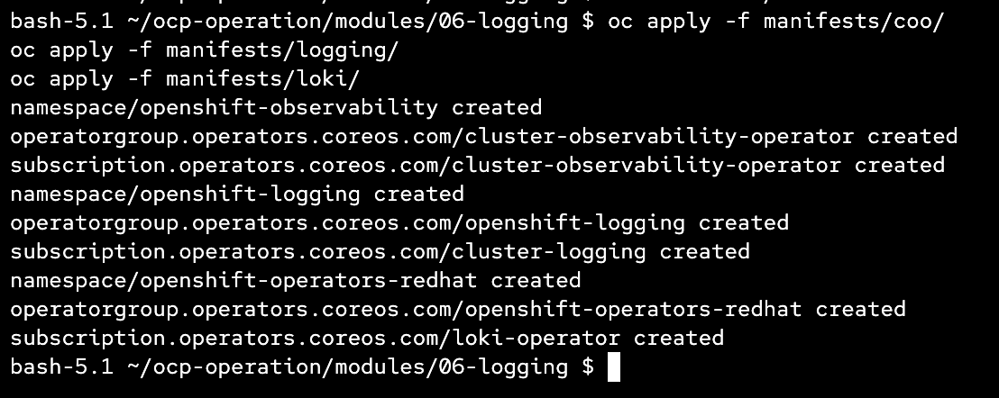
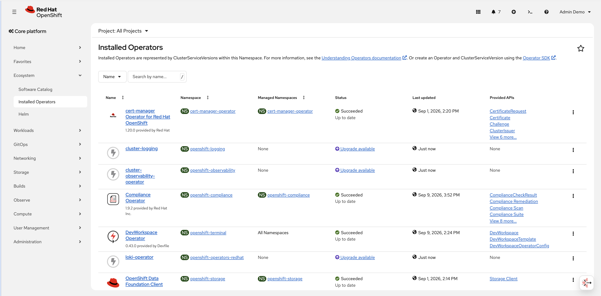

# Logging

This module sets up OpenShift logging with LokiStack as the log store, using ODF MCG (NooBaa) for S3 object storage.

---

### Operators

Three operators are required:

| Operator | Namespace | Channel |
|---|---|---|
| Cluster Observability Operator | `openshift-observability` | `stable` |
| Cluster Logging | `openshift-logging` | `stable-6.6` |
| Loki Operator | `openshift-operators-redhat` | `stable-6.6` |

All subscriptions use `installPlanApproval: Manual`.

---

### Step 1 — Install Operators

```bash
oc apply -f manifests/coo/
oc apply -f manifests/logging/
oc apply -f manifests/loki/
```



Approve the install plans manually:

```bash
oc get installplan -n openshift-observability
oc get installplan -n openshift-logging
oc get installplan -n openshift-operators-redhat

oc patch installplan <plan-name> -n <namespace> --type merge -p '{"spec":{"approved":true}}'
```
หรือใช้จากหน้า UI




---

### Step 2 — Create Object Bucket (ODF MCG)

```bash
oc apply -f manifests/loki-config/00-obc.yaml
```

This creates an `ObjectBucketClaim` named `loki` in `openshift-logging` backed by the NooBaa storage class.

---

### Step 3 — Create Service Account and ClusterRoleBindings

```bash
oc apply -f manifests/loki-config/01-sa-clusterrolebinding.yaml
```

Creates a `collector` service account with the following cluster roles:

- `logging-collector-logs-writer`
- `collect-application-logs`
- `collect-audit-logs`
- `collect-infrastructure-logs`

---

### Step 4 — Create Loki Secret from Bucket Credentials

```bash
cd manifests/loki-config
./02-get_secret.sh
```

The script extracts the access key, secret key, bucket name, and endpoint from the OBC and creates a secret named `loki-sec` in `openshift-logging`.

---

### Step 5 — Deploy LokiStack

```bash
oc apply -f manifests/loki-config/03-lokistack.yaml
```

Key configuration:

- Size: `1x.pico`
- Retention: `1 day`
- Storage: `ocs-external-storagecluster-ceph-rbd`
- All components pinned to infra nodes via `node-role.kubernetes.io/infra` node selector

---

### Step 6 — Deploy ClusterLogForwarder

```bash
oc apply -f manifests/loki-config/04-logging.yaml
```

Forwards `application`, `infrastructure`, and `audit` logs to the LokiStack. The collector tolerates all taints and uses the `collector` service account created in Step 3.

---

### Step 7 — Enable Logging UI Plugin

```bash
oc apply -f manifests/loki-config/05-ui-plugin.yaml
```

Adds the Logging UI plugin to the OpenShift console, connected to the `lokistack` instance.

---

### Updating Collector Resources

To adjust the collector's CPU/memory requests and limits, patch the `ClusterLogForwarder` directly:

```bash
oc patch clusterlogforwarder collector -n openshift-logging --type merge -p '
spec:
  collector:
    resources:
      requests:
        cpu: 190m
        memory: 1Gi
      limits:
        cpu: 1
        memory: 2Gi
'
```

Or edit interactively:

```bash
oc edit clusterlogforwarder collector -n openshift-logging
```

Update the `spec.collector.resources` section:

```yaml
spec:
  collector:
    resources:
      requests:
        cpu: 190m
        memory: 1Gi
      limits:
        cpu: 1
        memory: 2Gi
```


