# Logging

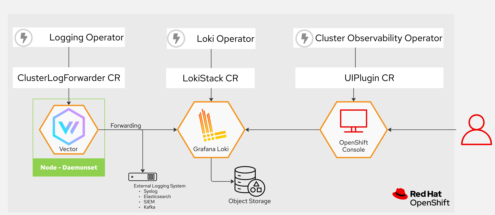

การสร้างระบบ Logging บน OpenShift โดยใช้ Loki Stack และใช้ Object Storage จาก ODF MCG

---

### Operators

3 Operators ที่ใช้ในการติดตั้งระบบ Loggin :

| Operator | Namespace | Channel |
|---|---|---|
| Cluster Observability Operator | `openshift-observability` | `stable` |
| Cluster Logging | `openshift-logging` | `stable-6.6` |
| Loki Operator | `openshift-operators-redhat` | `stable-6.6` |

ในการติดตั้ง Operator เราจะตั้งค่าการอัพเดทเป็น Manual เพื่อให้เราสามารถควบคุมเวอร์ชันของ Operator ได้ `installPlanApproval: Manual`.

---

### Step 1 — Install Operators

```bash
oc apply -f manifests/coo/
oc apply -f manifests/logging/
oc apply -f manifests/loki/
```
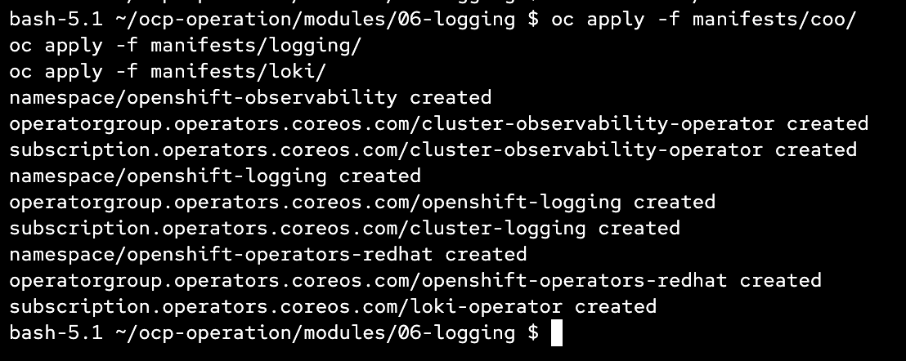


Approve เพื่อยืนยันการติดตั้ง:

```bash
oc get installplan -n openshift-observability
oc get installplan -n openshift-logging
oc get installplan -n openshift-operators-redhat

oc patch installplan <plan-name> -n <namespace> --type merge -p '{"spec":{"approved":true}}'
```
หรือใช้จากหน้า UI

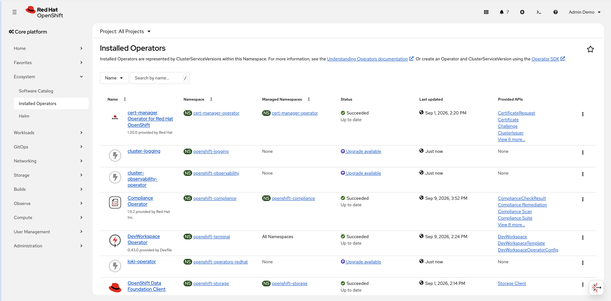


---

### Step 2 — Create Object Bucket (ODF MCG)

```bash
oc apply -f manifests/loki-config/00-obc.yaml
```

สร้าง Object Storage bucket ผ่าน ODF Multi Cloud Gateway. คล้ายๆกับการสร้าง bucket บน AWS S3 เพื่อใช้ในการเก็บข้อมูลของ Loki โดยจะสร้างที่ project `openshift-logging` ชื่อ `loki`

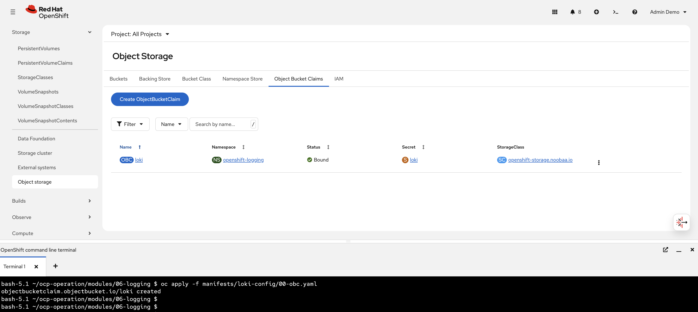

---

### Step 3 — Create Service Account and ClusterRoleBindings

```bash
oc apply -f manifests/loki-config/01-sa-clusterrolebinding.yaml
```

สร้าง Service Account เพื่อใช้สำหรับ collector ให้มีสิทธิ์ในการดึงข้อมูลจากแหล่งต่างๆที่จำเป็นก่อนส่งไปเก็บยัง Logging หรือ forward ต่อไป

- `logging-collector-logs-writer`
- `collect-application-logs`
- `collect-audit-logs`
- `collect-infrastructure-logs`

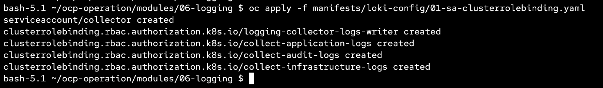
---

### Step 4 — Create Loki Secret from Bucket Credentials

สร้าง Secret ที่ใช้ในการเข้าถึง Object Storage ที่เราสร้างจาก ODF MCG โดย script จะทำการสร้าง secret ให้ใน projetc `openshift-logging`

```bash
cd manifests/loki-config
chmod +x 02-get_secret.sh
./02-get_secret.sh
```

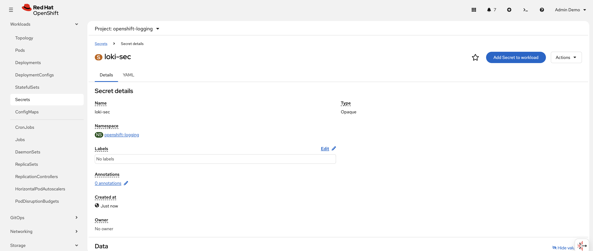

---

### Step 5 — Deploy LokiStack

```bash
oc apply -f manifests/loki-config/03-lokistack.yaml
```

Key configuration:

- Size: `1x.pico`
- Retention: `1 day`
- Storage: `ocs-external-storagecluster-ceph-rbd`
- All components pinned to infra nodes via `node-role.kubernetes.io/infra-observe` node selector
- All components added toleration for `node-role.kubernetes.io/infra=reserved:NoSchedule`

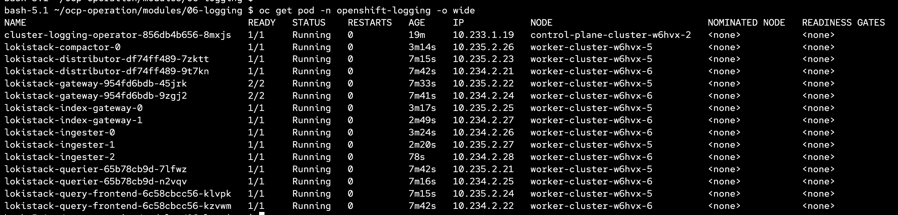
---

### Step 6 — Deploy ClusterLogForwarder

```bash
oc apply -f manifests/loki-config/04-logging.yaml
```

เราจะส่งข้อมูลไปเก็บยัง Loki ทั้งหมด 3 indexs คือ `application`, `infrastructure`, `audit` เพื่อใช้ในการทดสอบ


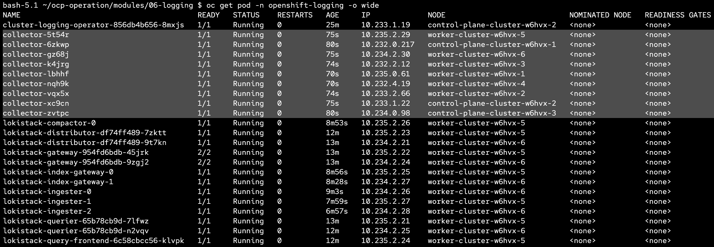

---

### Step 7 — Enable Logging UI Plugin

เปิดการใช้งาน Logging Console เพื่อให้มีหน้าในการดู log ผ่าน OpenShift Console ได้

```bash
oc apply -f manifests/loki-config/05-ui-plugin.yaml
```

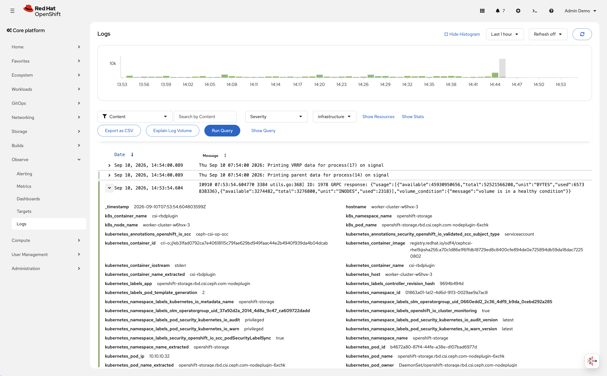

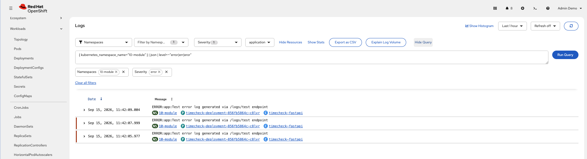

---

### Updating Collector Resources

ปรับค่า `collector` cpu request หรือ memory ได้. เนื่องจากโดยค่าตั้งต้น collector จะขอ cpu request ที่ `500m` 

```bash
oc patch clusterlogforwarder collector -n openshift-logging --type merge -p '
spec:
  collector:
    resources:
      requests:
        cpu: 190m
        memory: 1Gi
      limits:
        cpu: 1
        memory: 2Gi
'
```

หรือใช้คำสั่ง edit:

```bash
oc edit clusterlogforwarder collector -n openshift-logging
```

Update the `spec.collector.resources` section:

```yaml
spec:
  collector:
    resources:
      requests:
        cpu: 190m
        memory: 1Gi
      limits:
        cpu: 1
        memory: 2Gi
```

### Enable LogFileMetricExporter

เปิด metric สำหรับดูค่าว่า pod ไหนสร้าง log มากที่สุด

```yaml
apiVersion: logging.openshift.io/v1alpha1
kind: LogFileMetricExporter
metadata:
  name: instance
  namespace: openshift-logging
spec:
  resources:
    limits:
      cpu: 500m
    requests:
      cpu: 200m
      memory: 128Mi
  tolerations:
    - operator: Exists
```

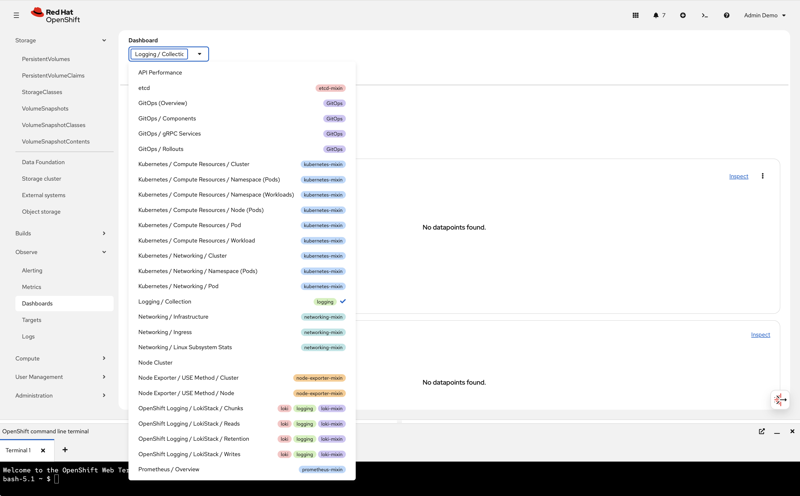

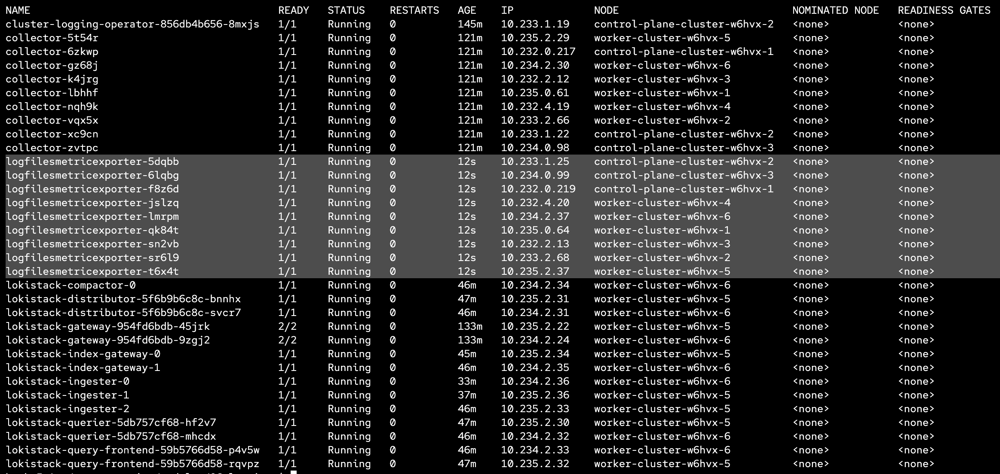

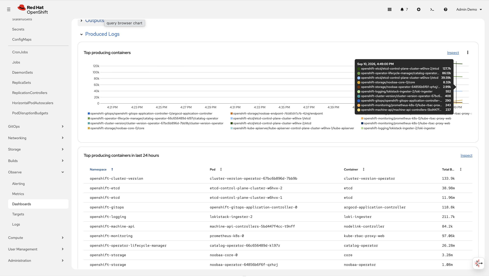
