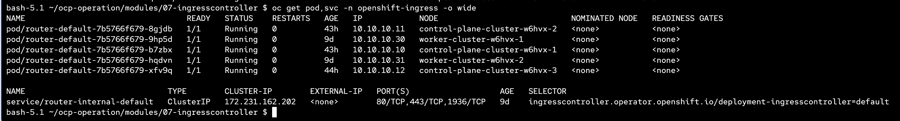
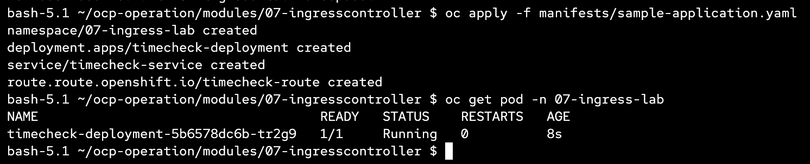
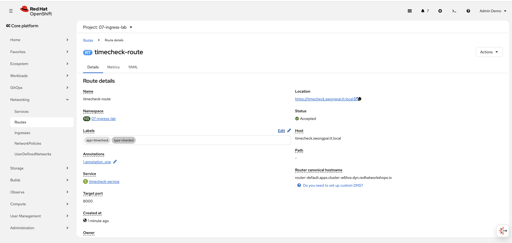
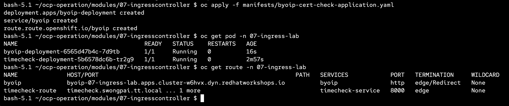
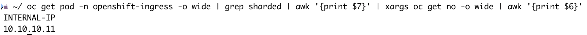
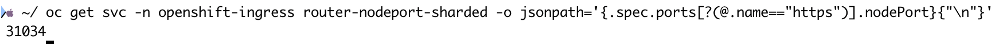
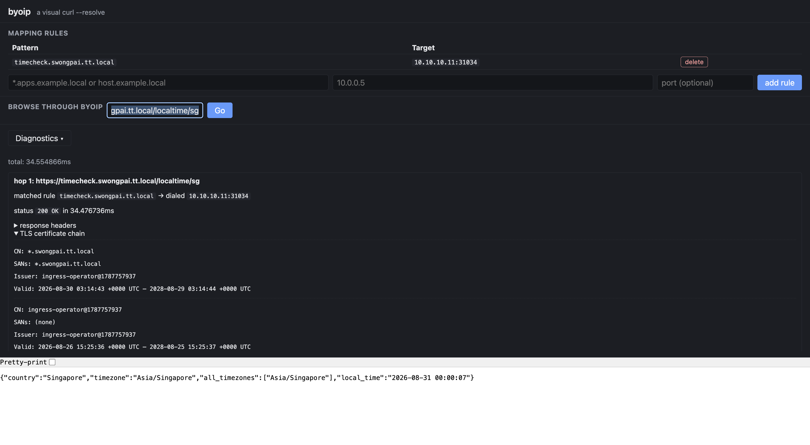
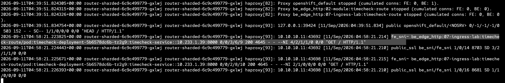

# IngressController Sharding

This module demonstrates how to create a sharded IngressController using `NodePortService` and route traffic to it via a specific domain.

---

### Overview

By default, the `default` IngressController handles all routes. With sharding, you create additional IngressControllers that only serve routes matching a specific label selector. This is useful for separating traffic by domain, team, or environment.

---

## Existing




## Create the Sharded IngressController

```bash
oc apply -f manifests/sharding.yaml
```


Key configuration in `sharding.yaml`:

| Parameter | Value | Description |
|---|---|---|
| `domain` | `swongpai.tt.local` | The domain this ingress serves |
| `endpointPublishingStrategy.type` | `NodePortService` | Exposes the router via a NodePort on each node |
| `routeSelector.matchLabels.type` | `sharded` | Only routes with label `type: sharded` use this ingress |
| `replicas` | `1` | Number of router pods |
| `logging.access.destination.type` | `Container` | Enables access logging to container stdout |

---

## Update the Default IngressController

To prevent the default IngressController from also handling sharded routes, add a `routeSelector` that excludes them:

```bash
oc patch ingresscontroller default -n openshift-ingress-operator --type merge -p '
spec:
  routeSelector:
    matchExpressions:
      - key: type
        operator: NotIn
        values:
          - sharded'
```

This ensures routes with `type: sharded` are only served by the sharded IngressController.

---

## Deploy the Sample Application

```bash
oc apply -f manifests/sample-application.yaml
```





This creates a namespace `sample-application` with:
- A `timecheck` Deployment and Service (port 8000)
- A Route with host `timecheck.swongpai.tt.local`, label `type: sharded`, and TLS edge termination

---

## Deploy the BYOIP Cert-Check Application (optional)

```bash
oc apply -f manifests/byoip-cert-check-application.yaml
```

A helper web app that lets you add DNS mapping rules and browse through the sharded ingress to verify TLS certificates and connectivity.

---

## Get the Node IP and NodePort

Find the internal IP of the node where the sharded router pod is running:

```bash
oc get pod -n openshift-ingress -o wide | grep sharded | awk '{print $7}' | xargs oc get no -o wide | awk '{print $6}'
```



Get the HTTPS NodePort of the sharded router service:

```bash
oc get svc -n openshift-ingress router-nodeport-sharded -o jsonpath='{.spec.ports[?(@.name=="https")].nodePort}{"\n"}'
```



---

## Test the Route

In the BYOIP web app, add a mapping rule:

- **Pattern**: `timecheck.swongpai.tt.local`
- **Target**: `<node IP>:<nodeport>`

Then browse to `https://timecheck.swongpai.tt.local` through the BYOIP proxy to verify the route, TLS certificate, and application response.



check ingress sharded logs 

```
oc logs -f -l ingresscontroller.operator.openshift.io/deployment-ingresscontroller=sharded -n openshift-ingress -c logs
```

