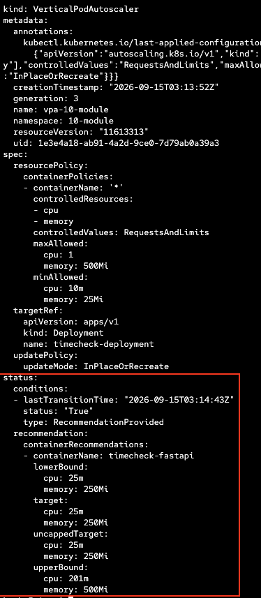

# Vertical Pod Autoscaler (VPA)

This module covers the **Vertical Pod Autoscaler (VPA)** — a mechanism that automatically recommends or adjusts CPU and memory requests/limits for containers based on actual usage.

> **Prerequisite:** The VPA operator must be installed. See [prep/manifests/vertical-pod-autoscaler.yaml](../../prep/manifests/vertical-pod-autoscaler.yaml) for the operator installation manifest.

---

### How VPA Works

VPA monitors historical and real-time resource usage of pods, then:
1. **Recommends** optimal CPU/memory requests and limits
2. **Optionally applies** those recommendations by evicting and recreating pods with updated resource specs

---

### Update Modes

| Mode | Description |
|---|---|
| `Off` | VPA only provides recommendations — does not modify pods - แนะนำอย่างเดียวไม่แก้ไขค่าของ application pod |
| `Initial` | VPA assigns resources at pod creation only — no updates to running pods - ใส่ค่าตั้งต้นให้เท่านั้น |
| `Recreate` | VPA evicts and recreates pods when recommendations change significantly - rolling pod เพื่ออัพเดทค่าที่ VPA แนะนำ|
| `InPlaceOrRecreate` | In this mode, the VPA automatically applies the recommended CPU and memory resources throughout the pod lifetime. When any pod in the project is out of alignment with the VPA recommendations, the VPA attempts to apply updates in-place, without restarting the pod. If the VPA is not able to update the containers in-place, the VPA deletes the pod - rolling pod เพื่ออัพเดทค่าที่ VPA แนะนำ|

> **Tip:** Start with `Off` to observe recommendations before enabling `Auto` in production.

---

### VPA Resource

This module creates a VPA targeting the `timechecker-deployment` in namespace `02-module`:

```yaml
apiVersion: autoscaling.k8s.io/v1
kind: VerticalPodAutoscaler
metadata:
  name: vpa-02-module
  namespace: 02-module
spec:
  targetRef:
    apiVersion: apps/v1
    kind: Deployment
    name: timechecker-deployment
  updatePolicy:
    updateMode: "Off"
  resourcePolicy:
    containerPolicies:
    - containerName: '*'
      controlledResources:
      - cpu
      - memory
      minAllowed:
        cpu: 10m
        memory: 25Mi
      maxAllowed:
        cpu: 1
        memory: 500Mi
```

---

### Key Parameters

#### `spec.targetRef`

| Field | Description |
|---|---|
| `apiVersion` | API version of the target workload (e.g. `apps/v1`) |
| `kind` | Workload kind: `Deployment`, `StatefulSet`, `DaemonSet`, etc. |
| `name` | Name of the target workload |

#### `spec.resourcePolicy.containerPolicies[]`

| Field | Description |
|---|---|
| `containerName` | Container name or `'*'` for all containers |
| `controlledResources` | Which resources VPA manages: `cpu`, `memory`, or both |
| `minAllowed` | Minimum resource values VPA will recommend |
| `maxAllowed` | Maximum resource values VPA will recommend |
| `mode` | `Auto` (default) or `Off` to exclude a specific container |

---

### Deploy

```bash
oc apply -f modules/10-VPA/manifests/02-module-deployment-vpa.yaml
```

### Check Recommendations

```bash
oc get vpa timecheck-deployment-vpa -n 02-module -o yaml
```



VPA recommendations appear under `status.recommendation.containerRecommendations`:

| Field | Description |
|---|---|
| `lowerBound` | Minimum recommended resources |
| `target` | Recommended resource requests |
| `upperBound` | Maximum recommended resources |
| `uncappedTarget` | Recommendation without `minAllowed`/`maxAllowed` constraints |

```bash
oc get vpa -n 02-module
oc describe vpa vpa-02-module -n 02-module
```

เช็ก deployment ใน 02-placement จะสังเกตุว่าไม่มี resource กำหนดใน deployment
แต่

---

### VPA vs HPA

| | VPA | HPA |
|---|---|---|
| Scaling direction | **Vertical** — adjusts CPU/memory per pod | **Horizontal** — adjusts number of pod replicas |
| When to use | Workloads that can't scale horizontally, or to right-size resource requests | Workloads with variable load that benefit from more replicas |
| Pod disruption | Evicts pods to apply new resources (in `Auto` mode) | No pod disruption — adds/removes replicas |
| Can be used together? | Yes, but do not let both control the same resource (e.g. VPA controls memory, HPA controls CPU) | Same |

> **Note:** When using VPA with HPA, ensure they do not manage the same resource metric to avoid conflicts.
