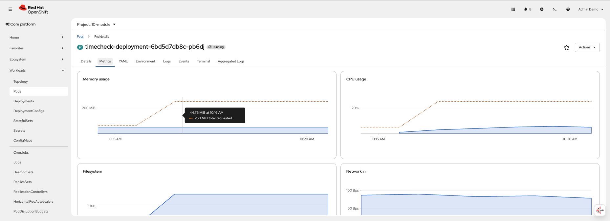

# Vertical Pod Autoscaler (VPA)

This module covers the **Vertical Pod Autoscaler (VPA)** — a mechanism that automatically recommends or adjusts CPU and memory requests/limits for containers based on actual usage.

> **Prerequisite:** The VPA operator must be installed. See [prep/manifests/vertical-pod-autoscaler.yaml](../../prep/manifests/vertical-pod-autoscaler.yaml) for the operator installation manifest.

---

### How VPA Works

VPA monitors historical and real-time resource usage of pods, then:
1. **Recommends** optimal CPU/memory requests and limits
2. **Optionally applies** those recommendations by evicting and recreating pods with updated resource specs

---

### Update Modes

| Mode | Description |
|---|---|
| `Off` | VPA only provides recommendations — does not modify pods - แนะนำอย่างเดียวไม่แก้ไขค่าของ application pod |
| `Initial` | VPA assigns resources at pod creation only — no updates to running pods - ใส่ค่าตั้งต้นให้เท่านั้น |
| `Recreate` | VPA evicts and recreates pods when recommendations change significantly - rolling pod เพื่ออัพเดทค่าที่ VPA แนะนำ|
| `InPlaceOrRecreate` | VPA attempts to apply updates in-place without restarting the pod. If unable to update in-place, VPA deletes and recreates the pod - พยายามปรับค่า resource โดยไม่ต้อง restart pod ก่อน ถ้าทำไม่ได้จะ rolling pod |

---

### Key Parameters

#### `spec.targetRef`

| Field | Description |
|---|---|
| `apiVersion` | API version of the target workload (e.g. `apps/v1`) |
| `kind` | Workload kind: `Deployment`, `StatefulSet`, `DaemonSet`, etc. |
| `name` | Name of the target workload |

#### `spec.resourcePolicy.containerPolicies[]`

| Field | Description |
|---|---|
| `containerName` | Container name or `'*'` for all containers |
| `controlledResources` | Which resources VPA manages: `cpu`, `memory`, or both |
| `controlledValues` | `RequestsOnly` (Burstable) or `RequestsAndLimits` (Guaranteed) |
| `minAllowed` | Minimum resource values VPA will recommend |
| `maxAllowed` | Maximum resource values VPA will recommend |
| `mode` | `Auto` (default) or `Off` to exclude a specific container |

#### `controlledValues` Summary

| Value | QoS Class | Description |
|---|---|---|
| `RequestsOnly` | Burstable | VPA ปรับเฉพาะ requests — limits คงเดิม |
| `RequestsAndLimits` | Guaranteed | VPA ปรับทั้ง requests และ limits ให้เท่ากัน — รักษา QoS Guaranteed |

---

### Deploy

#### Burstable QoS (`controlledValues: RequestsOnly`)

```bash
oc apply -f modules/10-VPA/manifests/sample-application.yaml
oc apply -f modules/10-VPA/manifests/10-module-deployment-vpa.yaml
```

#### Guaranteed QoS (`controlledValues: RequestsAndLimits`)

```bash
oc apply -f modules/10-VPA/manifests/sample-application-guaranteed.yaml
oc apply -f modules/10-VPA/manifests/10-module-deployment-vpa-guaranteed.yaml
```

### Check Recommendations

```bash
oc get vpa -n 10-module
oc get vpa vpa-10-module -n 10-module -o yaml
```


VPA recommendations appear under `status.recommendation.containerRecommendations`:

| Field | Description |
|---|---|
| `lowerBound` | Minimum recommended resources |
| `target` | Recommended resource requests |
| `upperBound` | Maximum recommended resources |
| `uncappedTarget` | Recommendation without `minAllowed`/`maxAllowed` constraints |

```bash
oc describe vpa vpa-10-module -n 10-module
```

---

### In-Place Pod Resize

OpenShift 4.20+, pods can have their CPU and memory updated **without restarting** — this is called **In-Place Pod Resize**. 

ตั้งแต่ OpenShift 4.20+ pod resize สามารถอัพเดทได้โดยไม่ต้อง rolling pod หรือ restart*

When VPA is set to `updateMode: InPlaceOrRecreate`, it attempts to resize containers in-place first. If in-place resize is not possible, it falls back to evicting and recreating the pod.

ตั้งค่า VPA updateMode เป็น InPlaceOrRecreate จะทำให้ VPA อัพเดทค่าของ pod ตามค่าทีี่แนะนำโดยจะพยายามไม่ rolling pod ก่อน แต่ถ้าไม่สำเร็จจะทำการ rolling pod 

#### Verify In-Place Resize

ตรวจสอบว่า pod ได้รับ resource ใหม่โดยไม่ถูก restart:

> **⚠️ QoS Class Constraint:** In-place resize จะทำได้เฉพาะเมื่อ resource ใหม่ที่ VPA แนะนำ **ไม่ทำให้ QoS class เปลี่ยน** เท่านั้น เช่น ถ้า pod เดิมเป็น `Burstable` แล้ว resource ใหม่ทำให้กลายเป็น `Guaranteed` (requests = limits) จะไม่สามารถ resize in-place ได้ — VPA จะ fallback ไปใช้การ recreate pod แทน ดังนั้นการใช้ `controlledValues: RequestsOnly` ทำให้ QoS class ให้คงเดิม (Burstable)

> **Pod ต้องมี Replicas > 1** สำหรับ In-place resize



---

### VPA vs HPA

| | VPA | HPA |
|---|---|---|
| Scaling direction | **Vertical** — adjusts CPU/memory per pod | **Horizontal** — adjusts number of pod replicas |
| When to use | Workloads that can't scale horizontally, or to right-size resource requests | Workloads with variable load that benefit from more replicas |
| Pod disruption | Evicts pods to apply new resources (in `Auto` mode) | No pod disruption — adds/removes replicas |
| Can be used together? | Yes, but do not let both control the same resource (e.g. VPA controls memory, HPA controls CPU) | Same |

> **Note:** อย่าใช้ VPA ร่วมกับ HPA เนื่องจากจะทำให้เกิด operator conflict เลือกใช้อย่างใดอย่างหนึ่ง.
