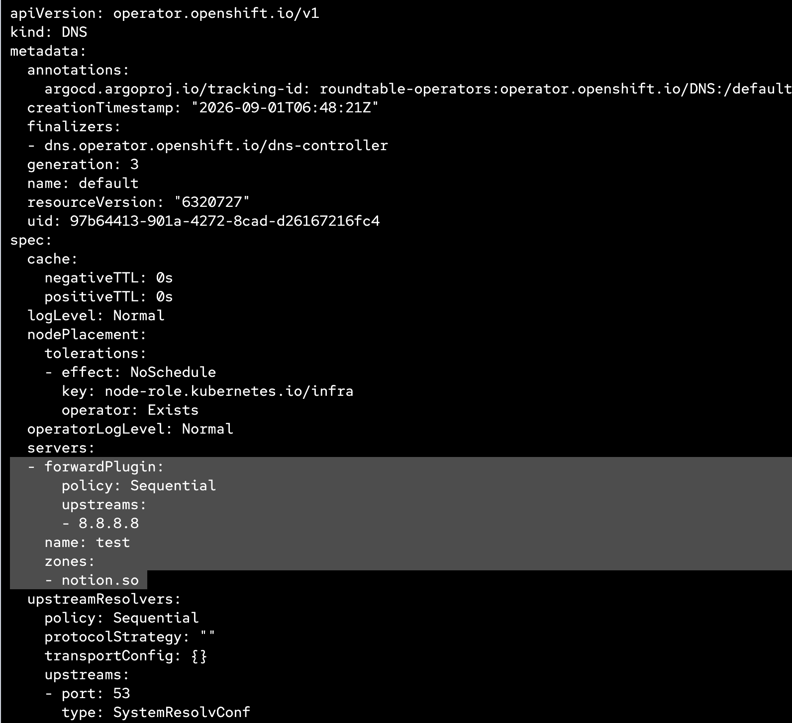
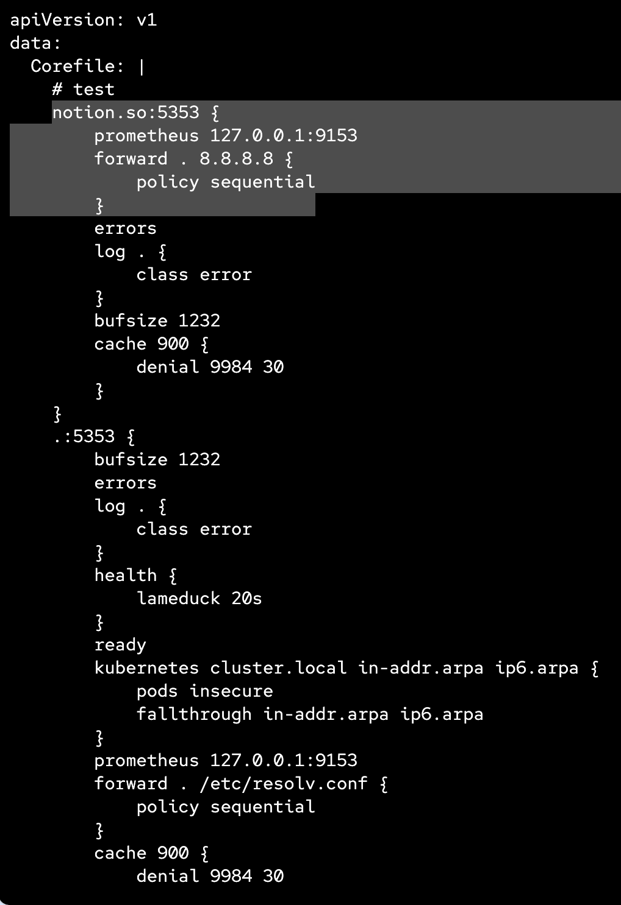
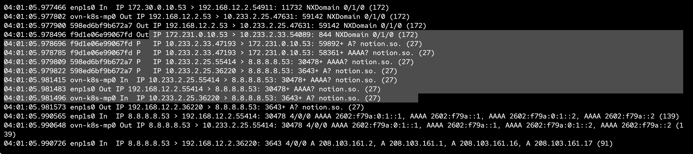
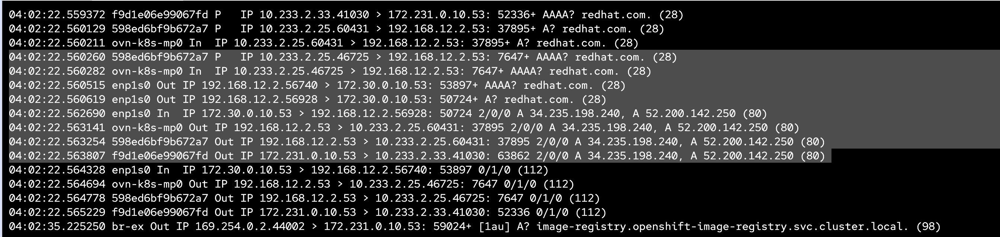

# Module 11 - DNS

## HostAliases Testing

`hostAliases` ใช้สำหรับเพิ่ม entry ลงใน `/etc/hosts` ของ Pod โดยตรง โดยไม่ต้องแก้ไข DNS server  
เหมาะสำหรับ:
- ทดสอบ internal hostname resolution
- override DNS ชั่วคราวในระดับ Pod
- mapping custom hostname ไปยัง IP ที่ต้องการ

### Deploy

```bash
oc apply -f modules/11-DNS/manifests/hostalias-test.yaml
```

### Verify

1. ตรวจสอบ Pod status:

```bash
oc get pods -n 11-dns-module
```

2. ดู `/etc/hosts` ภายใน Pod:

```bash
oc exec -n 11-dns-module deploy/hostalias-test -- cat /etc/hosts
```

ผลลัพธ์ควรมี entry ที่เพิ่มจาก `hostAliases`:

```
# Entries added by HostAliases.
10.0.0.100  myapp.internal.example.com  myapp-alias.internal.example.com
10.0.0.200  db.internal.example.com
10.0.0.300  cache.internal.example.com
```

3. ทดสอบ resolution:

```bash
oc exec -n 11-dns-module deploy/hostalias-test -- getent hosts myapp.internal.example.com
oc exec -n 11-dns-module deploy/hostalias-test -- getent hosts db.internal.example.com
```

4. ดู startup logs:

```bash
oc logs -n 11-dns-module deploy/hostalias-test
```

### Cleanup

```bash
oc delete -f modules/11-DNS/manifests/hostalias-test.yaml
```

### Key Points

| Field | Description |
|-------|------------|
| `spec.hostAliases[].ip` | IP address ที่ต้องการ map |
| `spec.hostAliases[].hostnames` | list ของ hostname ที่จะ resolve ไปยัง IP นั้น |

> **Note:** `hostAliases` จะถูกเพิ่มเข้าไปใน `/etc/hosts` ของ Pod เท่านั้น ไม่กระทบ DNS ของ cluster หรือ Pod อื่น

---

## DNS Forward Plugin

ใช้ `spec.servers` ใน `DNS/default` (operator.openshift.io) เพื่อ forward DNS query ของ domain ที่ระบุไปยัง upstream DNS server ภายนอก แทนที่จะ resolve ผ่าน CoreDNS ของ cluster

### ตัวอย่าง: Forward `notion.so` ไปยัง `8.8.4.4`

```bash
oc patch dns.operator.openshift.io/default --type=merge -p '
{
  "spec": {
    "servers": [
      {
        "name": "test",
        "zones": [
          "notion.so"
        ],
        "forwardPlugin": {
          "policy": "Random",
          "upstreams": [
            "8.8.4.4"
          ]
        }
      }
    ]
  }
}'
```

หรือใช้ `oc edit`:

```bash
oc edit dns.operator.openshift.io/default
```

แล้วเพิ่มใน `spec`:

```yaml
spec:
  servers:
    - name: test
      zones:
        - notion.so
      forwardPlugin:
        policy: Random
        upstreams:
          - 8.8.8.8
```

### Verify

1. ตรวจสอบ DNS operator config:

```bash
oc get dns.operator.openshift.io/default -o yaml
```



2. ตรวจสอบ CoreDNS ConfigMap ที่ถูก generate:

```bash
oc get configmap dns-default -n openshift-dns -o yaml
```




### Testing 
<WIP will use tcpdump toolbox>




### Forward Plugin Policy

| Policy | Description |
|--------|------------|
| `Random` | สุ่มเลือก upstream server |
| `RoundRobin` | วนเลือก upstream server ตามลำดับ |
| `Sequential` | ใช้ server แรกเสมอ ถ้า fail จึงไปตัวถัดไป |

### Cleanup

ลบ servers ออก:

```bash
oc patch dns.operator.openshift.io/default --type=merge -p '{"spec":{"servers":[]}}'
```

> **Note:** การเพิ่ม `servers` จะมีผลทั้ง cluster — ทุก Pod จะ resolve domain ที่ระบุผ่าน upstream ที่กำหนด
